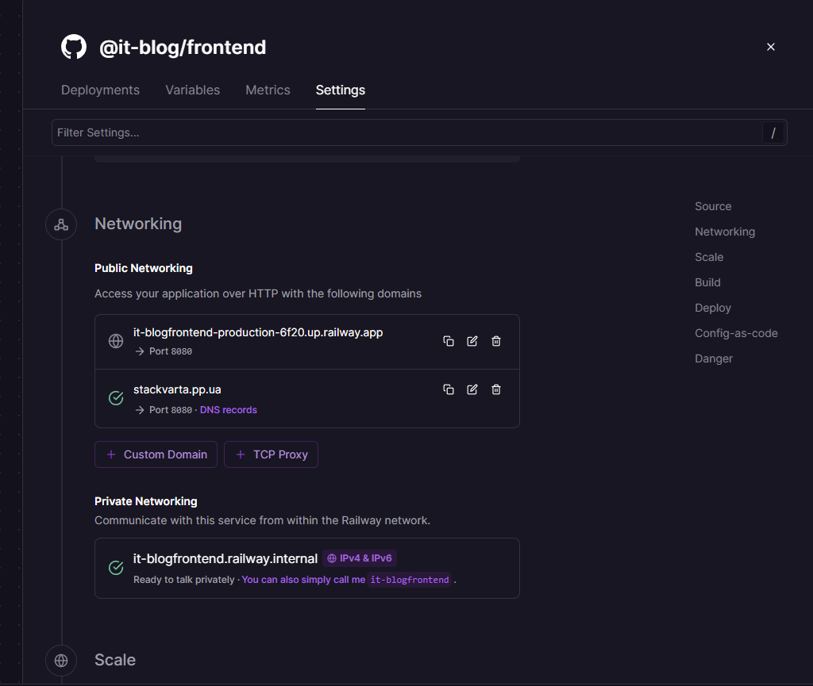
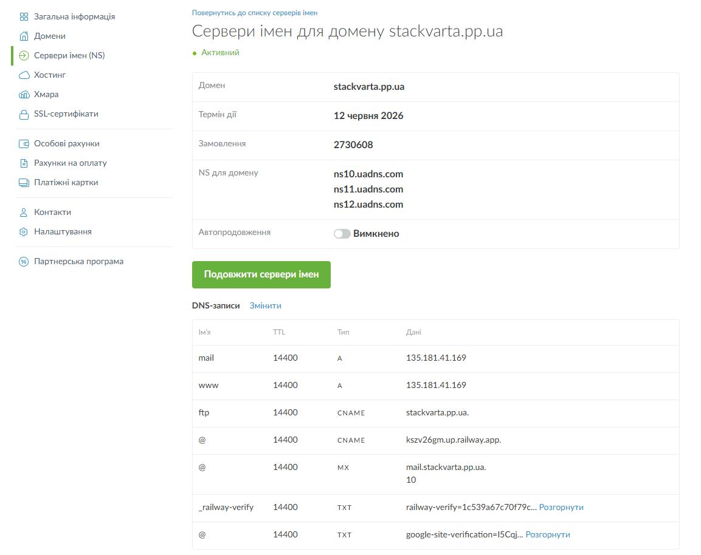
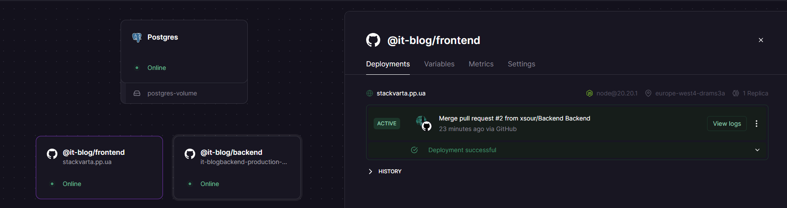
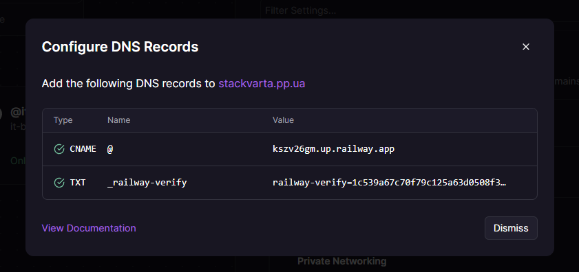
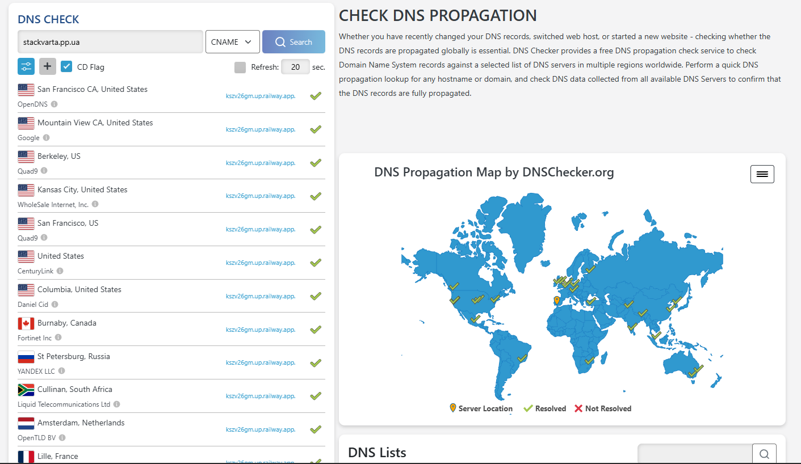
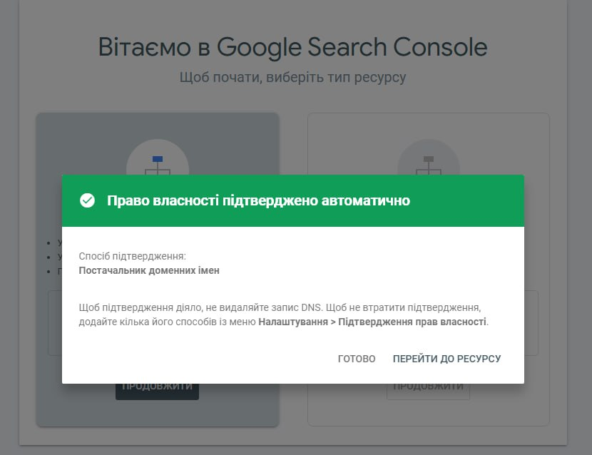
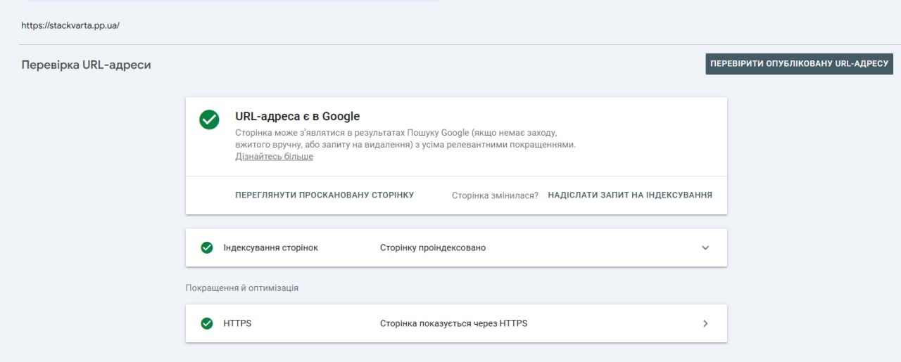
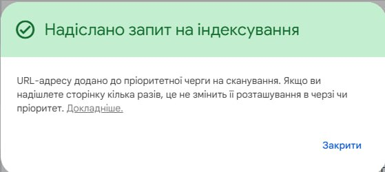

# Лабораторна робота №1
1\. URL розгорнутого сайту на Railway

2\. Назва зареєстрованого домену

[stackvarta.pp.ua](http://stackvarta.pp.ua)

3\. Скріншот успішного deploy на Railway

4\. Вміст файлу curl-result.txt з поясненням що ти бачиш

У файлі curl-result.txt ми бачимо:

1)  Повна доступність контенту: На відміну від звичайних клієнтських додатків (CSR), де замість контенту зазвичай видно лише порожній \<div\>, тут ми бачимо реальні тексти статей, заголовки та посилання.

2)  SEO-оптимізований заголовок (Head): Файл містить усі необхідні мета-теги, які Googlebot використовує для розуміння тематики сайту.

3)  Next.js Data Hydration: В кінці файлу видно скрипти self.\_\_next_f.push. Це серіалізовані дані, які Next.js використовує для того, щоб "оживити" сторінку на стороні клієнта, зберігаючи при цьому переваги швидкого першого завантаження.

4)  Семантична верстка: Використовуються правильні теги (\<header\>, \<main\>, \<section\>, \<article\>), що полегшує роботу алгоритмам Google у визначенні ієрархії та важливості контенту.

| Елемент                     | Присутній | Що містить                                                                                                                                                 |
|-----------------------------|-----------|------------------------------------------------------------------------------------------------------------------------------------------------------------|
| Текст статей                | Так       | Заголовки та уривки статей. Наприклад: "Next.js App Router для SEO-орієнтованого блогу", "Семантична головна сторінка без зайвого шуму" тощо.              |
| \<title\>                   | Так       | IT Blog — новини та статті про технології                                                                                                                  |
| \<meta name="description"\> | Так       | Останні матеріали про frontend, backend, DevOps, AI, кібербезпеку та корисні інструменти.                                                                  |
| Вміст \<body\>              | Так       | Повна структура сторінки: шапка (header) з навігацією, основний блок (main) з hero-секцією, переліком категорій та сіткою статей, а також підвал (footer). |

5\. Порівняльна таблиця curl vs View Source vs DevTools

| Параметр порівняння                          | curl                                                         | View Page Source                                              | DevTools                                                               |
|----------------------------------------------|--------------------------------------------------------------|---------------------------------------------------------------|------------------------------------------------------------------------|
| Що ми бачимо?                                | Сирий HTML-код, який сервер надсилає напряму.                | Початковий HTML-код до того, як браузер його обробив.         | Фінальне дерево елементів (DOM) після виконання всіх скриптів.         |
| Для кого призначене дане представлення коду? | Для автоматизованих систем та пошукових роботів (Googlebot). | Для швидкого технічного аудиту розробниками та SEO-фахівцями. | Для веб браузера та розробників під час інтерактивної роботи з сайтом. |
| Мета-теги та контент                         | Присутні завдяки SSR.                                        | Присутні завдяки SSR.                                         | Присутні (можуть змінюватись динамічно).                               |
| Виконання JavaScript                         | Відсутнє.                                                    | Відсутнє.                                                     | Повне виконання (результат роботи скриптів).                           |
| Стилі та зображення                          | Тільки текстові посилання на них.                            | Тільки текстові посилання.                                    | Повністю відображений візуал.                                          |

6\. Скріншот верифікації в Google Search Console

7\. Скріншот запиту на індексацію

8\. Відповідь на питання: "Що побачить Google crawler на вашому сайті

і чому це може бути проблемою?"

Google crawler побачить повний HTML-код сторінки з усіма заголовками та текстами статей, оскільки ми використовуємо SSR. Це було б проблемою при використанні CSR, бо тоді робот спочатку бачив би порожню сторінку, що призвело б до затримок в індексації або неправильного відображення сайту в результатах пошуку.

**Контрольні питання**

Рівень 1 - Розуміння термінів

1.  *Що таке SEO і чим відрізняється від платної реклами (SEA)?*

> **SEO (Search Engine Optimization)** — це комплекс заходів для покращення позицій сайту в органічній видачі пошукових систем. Ми працюємо над якістю контенту, швидкістю (SSR) та технічним станом.
>
> **SEA (Search Engine Advertising)** — це платна контекстна реклама (наприклад, Google Ads). Ми платимо за кожен клік користувача, і наш сайт з'являється у блоці з позначкою "Реклама".
>
> **Основна різниця:** SEO дає довготривалий результат без прямої оплати за кліки, а SEA працює миттєво, але тільки доки ми поповнюємо бюджет.

2.  *Поясніть різницю між crawling, indexing та ranking. Наведіть аналогію з реального життя.*

> Уявіть величезну бібліотеку, де постійно з'являються нові книги:
>
> *Crawling (Сканування):* Це робот-бібліотекар, який обходить усі полиці та відкриває нові книжки (сторінки), щоб зрозуміти, про що вони.
>
> *Indexing (Індексація):* Це процес занесення книги до каталогу бібліотеки. Якщо книги немає в каталозі, ніхто не зможе її знайти через пошук.
>
> *Ranking (Ранжування):* Коли читач просить "книгу про Python", бібліотекар вирішує, яку покласти зверху стопки на основі її якості та популярності.

3.  *Що таке DNS і яку роль він відіграє при відкритті веб-сайту?*

> **DNS (Domain Name System)** — це "телефонна книга" інтернету. Комп'ютери спілкуються за допомогою IP-адрес (цифр, наприклад 185.25.116.10), а людям зручно запам'ятовувати імена (stackvarta.pp.ua).
>
> **Роль:** Коли ми вводимо назву сайту, DNS знаходить цифрову адресу сервера, на якому цей сайт "живе", і з'єднує нас із ним.

4.  *Що таке CNAME запис і чим він відрізняється від A запису?*

> **A запис (Address):** Напряму пов'язує доменне ім'я з IP-адресою сервера (цифрами).
>
> **CNAME запис (Canonical Name):** Пов'язує один домен з іншим доменом (псевдонімом).
>
> У нашому проєкті ми використовували CNAME, щоб наш домен на nic.ua вказував на технічну адресу. Це зручно, бо якщо Railway змінить IP свого сервера, наш сайт не "впаде", оскільки посилання йде на ім'я, а не на цифри.

5.  *Навіщо потрібен TXT запис у DNS? Які ще завдання він може виконувати крім верифікації GSC?*

> **TXT запис** — це текстовий запис у налаштуваннях домену, який містить будь-яку інформацію для зовнішніх сервісів.
>
> Окрім верифікації в Google Search Console, він використовується для:

- Налаштування пошти (SPF, DKIM, DMARC): Підтверджує, що листи з нашого домену не є спамом.

- Верифікації в інших сервісах: Facebook, Microsoft 365, верифікація SSL-сертифікатів.

- Загальних нотаток: Будь-яка текстова інформація про власника або сервіс.

Рівень 2 - Аналіз

6.  *Ви виконали curl запит до свого сайту і побачили лише \
\</div\>. Поясніть чому так відбувається і що це означає для пошукових систем.*

> Це означає, що наш сайт використовує клієнтський рендеринг (CSR), за якого сервер віддає порожній HTML-шаблон, а весь контент завантажується за допомогою JavaScript вже у браузері користувача. Для пошукових систем це є суттєвою проблемою, оскільки робот спочатку бачить порожню сторінку без тексту та мета-даних, що призводить до затримок в індексації або неправильного відображення сайту в результатах пошуку.

7.  *Чим відрізняється View Page Source від перегляду DOM у DevTools? Чому це важливо для SEO?*

> View Page Source показує початковий HTML-код, який прийшов безпосередньо від сервера, тоді як у DevTools ми бачимо фінальний стан сторінки (DOM) після виконання всіх скриптів та перетворень браузером. Для SEO це важливо, тому що більшість пошукових роботів орієнтуються саме на початковий код із View Source, і якщо там немає тексту або мета-тегів, сайт може не потрапити в індекс або ранжуватися гірше.

8.  *Що таке DNS propagation і чому зміни в DNS не застосовуються миттєво?*

> DNS propagation — це процес оновлення бази даних DNS-серверів по всьому світу після внесення змін до налаштувань нашого домену. Зміни не застосовуються миттєво через кешування: провайдери та сервери зберігають старі записи протягом певного часу (визначеного параметром TTL), щоб пришвидшити роботу мережі та не робити запити до головного сервера щоразу.

9.  *Яка різниця між White, Grey та Black SEO? Наведіть конкретні приклади технік для кожного.*

> White Hat SEO — це легальні методи просування, які повністю відповідають правилам пошукових систем і орієнтовані на якість для користувача. Прикладом є написання корисних статей, технічна оптимізація швидкості сайту (SSR) та покращення мобільної версії.
>
> Grey Hat SEO — це перехідна зона, де використовуються методи, що прямо не порушують правила, але намагаються маніпулювати алгоритмами. Сюди належить закупівля посилань на перевірених біржах, створення мереж власних сайтів (PBN) або надмірне використання ключових слів, яке все ще виглядає природно.
>
> Black Hat SEO — це грубі порушення правил пошукових систем з метою швидкого отримання результату, що несе високий ризик бану сайту. Конкретними прикладами є клоакінг (показує роботам один контент, а людям — інший), прихований текст (білі літери на білому фоні) або масовий спам посиланнями в коментарях.

10. *Чому Google Search Console вимагає підтвердження власника сайту і які є способи верифікації?*

> Підтвердження власності необхідне для того, щоб Google міг гарантувати безпеку даних і надавати доступ до конфіденційної інформації про сайт лише його справжньому власнику. Оскільки Google Search Console дозволяє бачити запити користувачів, видаляти сторінки з пошуку та отримувати сповіщення про критичні помилки або злами, верифікація захищає наш ресурс від несанкціонованого керування сторонніми особами.
>
> Основними способами верифікації є:

- DNS TXT запис: додавання спеціального коду в налаштування домену у реєстратора. Це найнадійніший спосіб, що підтверджує власність на весь домен разом із піддоменами.

- HTML файл: завантаження невеликого файлу, наданого Google, у кореневу папку нашого сайту.

- Мета-тег: додавання спеціального тегу \<meta name="google-site-verification" content="..." /\> у секцію \<head\> головної сторінки сайту.

- Google Analytics або Google Tag Manager: використання вже існуючих кодів відстеження цих сервісів на нашому сайті.

Рівень 3 - Синтез та висновки

11. *На основі результатів лабораторної роботи - чи готовий ваш сайт до індексації? Обґрунтуйте відповідь.*

> На основі отриманих результатів ми можемо стверджувати, що наш сайт повністю готовий до індексації.
>
> Обґрунтування базується на трьох ключових факторах:

- **Наявність контенту в початковому коді:** Аналіз за допомогою curl та View Page Source підтвердив, що завдяки використанню SSR (Server-Side Rendering) весь текстовий вміст статей, заголовки та категорії доступні пошуковому роботу миттєво, без необхідності очікування рендерингу JavaScript.

- **Коректність мета-даних:** Всі важливі для SEO теги, такі як \<title\>, \<meta name="description"\> та \<link rel="canonical"\>, присутні в HTML-документі та містять релевантну інформацію, що дозволить Google сформувати привабливі та точні сніпети в результатах пошуку.

- **Успішна верифікація:** Ми успішно підтвердили право власності на домен у Google Search Console за допомогою DNS-запису, що дозволяє нам напряму керувати процесом сканування та відстежувати ефективність індексації.

12. *Googlebot вміє виконувати JavaScript, але все одно існує проблема з CSR сайтами. Дослідіть та поясніть чому.*

> Хоча Googlebot значно вдосконалив свої можливості з роками, проблема з CSR (Client-Side Rendering) залишається актуальною через двохетапний процес обробки сторінок, який називають The Second Wave of Indexing (Друга хвиля індексації).
>
> Ось основні причини, чому це є проблемою для нашого проєкту:

1)  Двохетапна індексація та черга на рендеринг

> Коли робот знаходить сторінку, він негайно сканує сирий HTML. У випадку з CSR цей код порожній. Щоб побачити контент, робот має запустити процес рендерингу. Цей етап потребує значно більше обчислювальних ресурсів, тому Google відкладає його. Як наслідок, сторінка може потрапити в індекс як "порожня" або її повна індексація затримається на дні чи навіть тижні, доки у Google з'являться вільні ресурси для виконання JavaScript.

2)  Вичерпання краулінгового бюджету (Crawl Budget)

> На кожен сайт Google виділяє певну кількість часу та ресурсів для сканування. Виконання JavaScript у тисячі разів "дорожче" для серверів Google, ніж читання статичного HTML. Як наслідок, якщо сайт має сотні статей на базі CSR, робот може просто не встигнути відрендерити їх усі, і частина важливого контенту ніколи не з'явиться в пошуку.

3)  Ризик помилок виконання скриптів

> Googlebot використовує сучасний двигун Chrome (Evergreen Googlebot), але він все одно може зіткнутися з проблемами:

- **Таймаути:** Якщо API нашого бекенду відповідає довше 5 секунд, робот може припинити очікування та проіндексувати порожню сторінку.

- **Помилки в коді:** Будь-яка помилка в JavaScript, яка не критична для браузера, може повністю зупинити рендеринг для робота.

4)  Недоступність мета-тегів для соціальних мереж

> Хоча Google намагається рендерити JS, інші роботи (Facebook, LinkedIn, Twitter, Slack) цього майже не роблять. Як наслідок, якщо title та description генеруються через JS на клієнті, то при поширенні посилання в месенджерах замість красивого сніпета відобразиться просто назва домену або порожній блок.

13\. *Запропонуйте три конкретні зміни які можна зробити вже зараз (без переходу на SSR) щоб покращити індексацію CSR сайту.*

1)  Використання Dynamic Rendering (Динамічний рендеринг)

> Це техніка, за якої сервер визначає, хто робить запит: людина чи робот. Якщо це людина — сайт віддається як звичайний CSR. Якщо це пошуковий робот (через перевірку User-Agent) — запит перенаправляється на сервіс на кшталт Prerender.io або Rendertron. Цей сервіс заздалегідь рендерить сторінку і віддає роботу вже готовий HTML-код.

2)  Оптимізація семантичного скелета (Critical Path HTML)

> Навіть у CSR можна додати в початковий HTML-файл (index.html) базову структуру. Ми можемо прописати там статичні заголовки (\<h1\>), навігацію та, головне, статичні мета-теги для головної сторінки. Також варто використовувати спеціальні "плейсхолдери" з текстовими ключовими словами, які будуть замінені контентом після завантаження JS.

3)  Створення точної XML-карти сайту (Sitemap.xml)

> Оскільки роботам важко "проходити" по клієнтських посиланнях у CSR, ми маємо створити детальну карту сайту, де перераховані всі актуальні посилання на статті. Це посилання потрібно додати в Google Search Console.

14\. *Порівняйте два підходи до верифікації в GSC: через DNS TXT та через HTML файл. Які переваги та недоліки кожного?*

**Верифікація через DNS TXT запис** - цей метод передбачає додавання спеціального текстового рядка в налаштування нашого домену на рівні реєстратора.

Переваги:

- Підтвердження всього домену: Це єдиний спосіб отримати статус «Domain property», що дозволяє бачити дані по всьому домену, включаючи всі піддомени (www, m, blog) та протоколи (http/https).

- Надійність: Запис залишається в системі DNS незалежно від того, чи переписуємо ми код сайту або чи змінюємо хостинг.

Недоліки:

- Затримка: Через процес розповсюдження DNS-записів (propagation) підтвердження може тривати від кількох хвилин до 24 годин.

- Складність: Потребує доступу до панелі керування доменом, що не завжди є у всіх учасників проєкту.

**Верифікація через HTML-файл -** цей підхід полягає у завантаженні невеликого файлу, наданого Google, у кореневу папку нашого сайту на сервері (хостингу).

Переваги:

- Миттєвість: Google бачить файл одразу після завантаження, тому верифікація проходить миттєво.

- Простота для розробника: Достатньо мати доступ до файлової системи через FTP або завантажити файл у папку public нашого проєкту.

Недоліки:

- Обмеженість: Підтверджується лише конкретна адреса (наприклад, тільки https://stackvarta.pp.ua). Якщо ми захочемо відстежувати піддомен, файл доведеться завантажувати знову.

- Ризик видалення: Якщо під час оновлення сайту файл буде випадково видалений з сервера, ми миттєво втратимо доступ до даних у Search Console.

Для нашого проєкту ми обрали **DNS-верифікацію**, оскільки вона є більш фундаментальною та дозволяє в майбутньому масштабувати сайт без повторного підтвердження прав.
