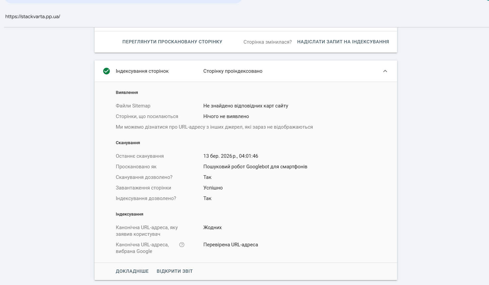
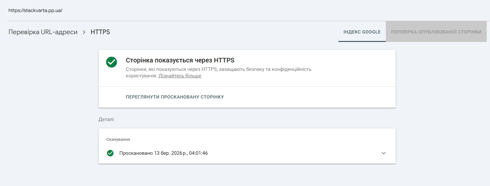
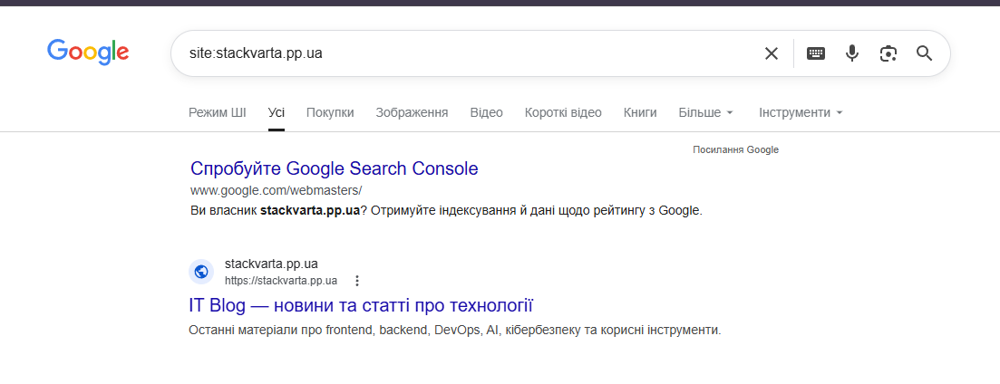
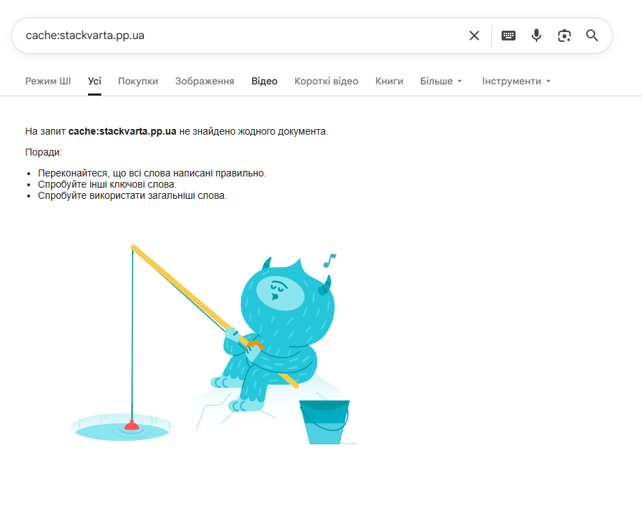
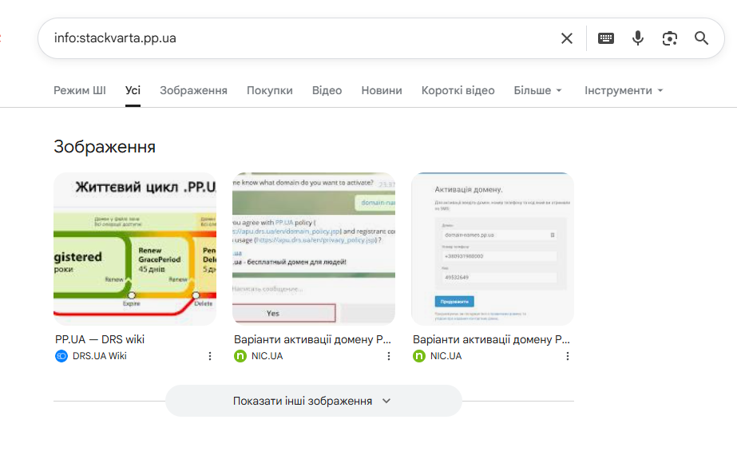
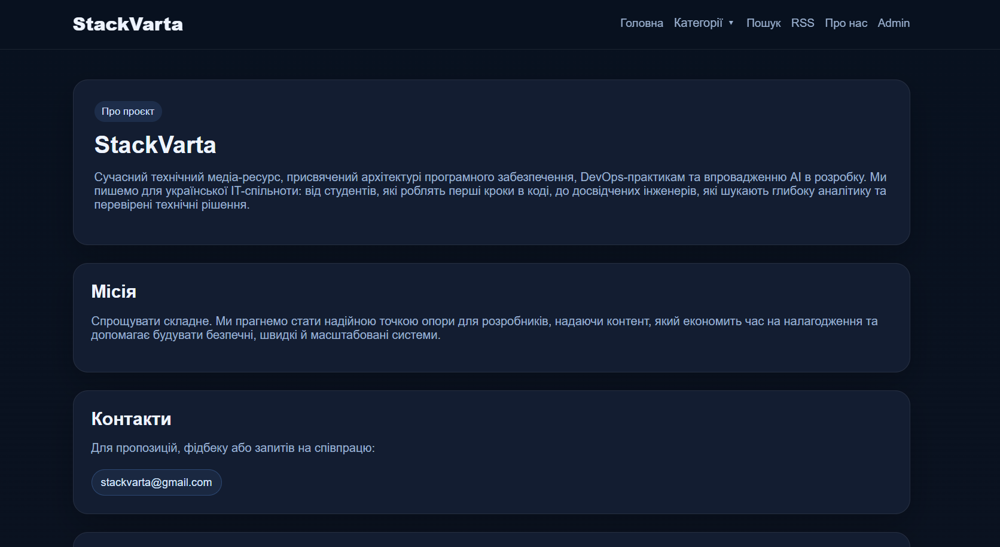
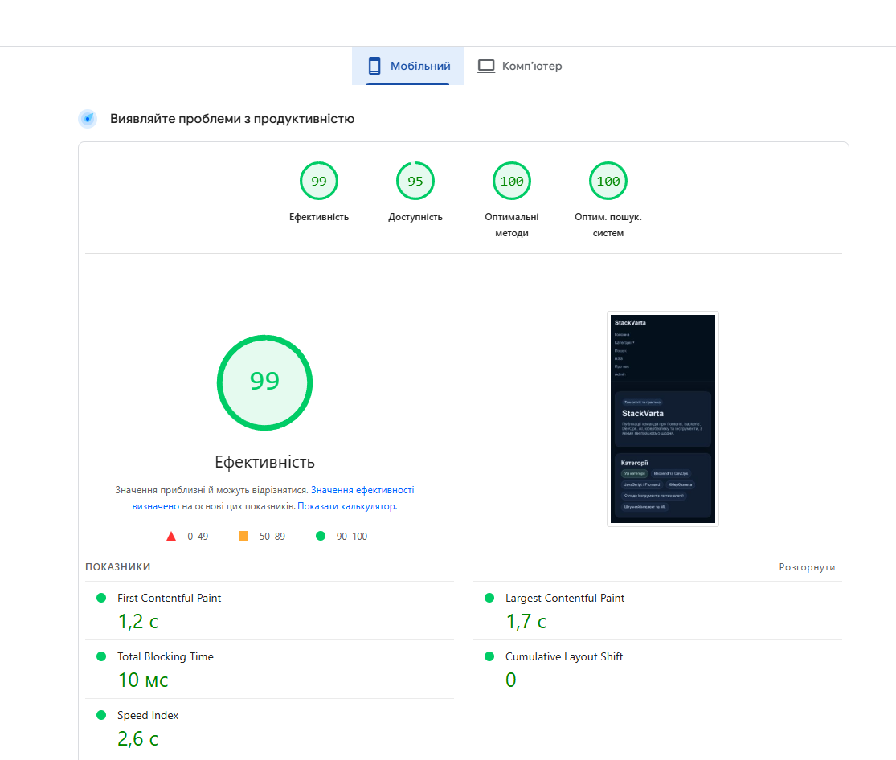
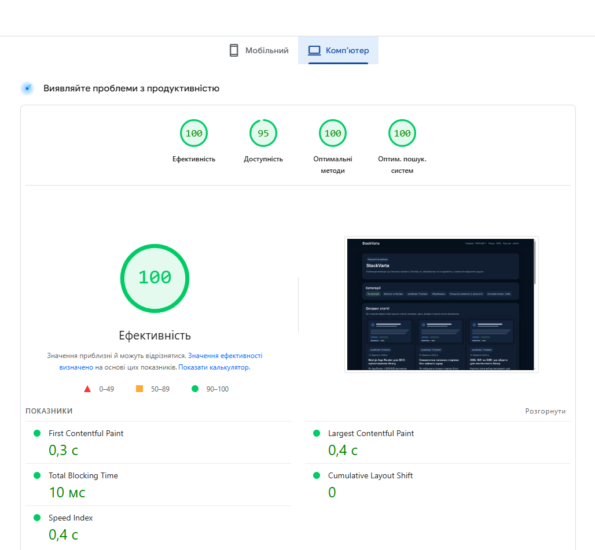
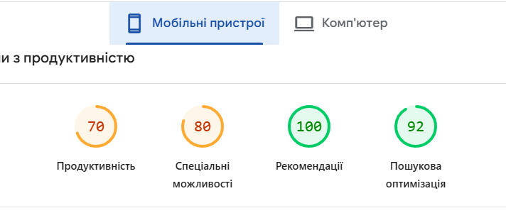
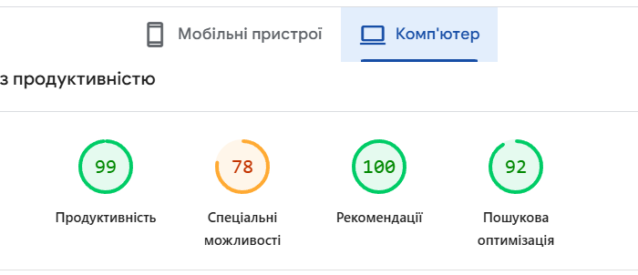

# Лабораторна робота №2
Завдання 1.1

| Параметр                           | Значення                                                                                       |
|------------------------------------|------------------------------------------------------------------------------------------------|
| Статус індексації                  | URL-адреса є в Google / Сторінку проіндексовано                                                |
| Дата останнього crawl              | 13 бер. 2026 р., 04:01:46                                                                      |
| Метод виявлення URL                | Sitemap не знайдено; сторінки, що посилаються, не виявлено; URL виявлено з інших джерел Google |
| Чи дозволено індексацію robots.txt | Так                                                                                            |
| Чи є canonical                     | Користувацький canonical відсутній; canonical, вибраний Google — перевірена URL-адреса         |
| Статус рендерингу (screenshot)     | Рендеринг успішний, screenshot доступний                                                       |

1\. Coverage

2\. Enhancements

Завдання 1.2

| Оператор | Результат | Що це означає |
|---|---|---|
| site: | Успішно. Знайдено 1 результат. | Сайт офіційно введений у публічний індекс Google. Це підтверджує, що технічне налаштування SSR та домену пройшло успішно. |
| cache: | Не знайдено жодного документ | Сторінка проіндексована, але Google ще не зберіг її статики у своєму кеші. Це типово для нових сайтів. |
| info: | Відображення блоку "Зображення" та посилань на реєстраторів. | Google розпізнає доменну зону .pp.ua, але ще не сформував персоналізовану картку "інформації про сайт". Замість цього він підтягує загальні дані про життєвий цикл домену. |

Завдання 1.3

| **Статус**                         | **Пояснення**                                                                  | **Можлива причина**                                                                         |
|------------------------------------|--------------------------------------------------------------------------------|---------------------------------------------------------------------------------------------|
| Submitted and indexed              | Сторінка успішно пройшла всі перевірки й доступна в пошуку.                    | Правильна карта сайту (sitemap) та якісний контент.                                         |
| Crawled - currently not indexed    | Робот завітав на сторінку, прочитав її, але вирішив поки не додавати в індекс. | Контент низької якості, занадто короткий текст або дубль іншої сторінки.                    |
| Discovered - currently not indexed | Google знайшов посилання на сторінку, але ще не встиг її навіть просканувати.  | Економія краулінгового бюджету або перевантаження сервера.                                  |
| Excluded by noindex tag            | Сторінка свідомо закрита від пошуку через мета-тег у коді.                     | Тестові сторінки або службові розділи, де стоїть content="noindex".                         |
| Blocked by robots.txt              | Google хотів зайти, але ми заборонили доступ у файлі конфігурації.             | У robots.txt прописано Disallow для цієї директорії (напр. /admin).                         |
| Redirect error                     | Бот потрапив у ланцюжок редіректів, який нікуди не веде або занадто довгий.    | Помилка в налаштуваннях next.config.js або циклічне перенаправлення.                        |
| 404 Not Found                      | Посилання веде "в нікуди" — сторінки фізично не існує.                         | Сторінку видалили, або була змінена структура URL без 301-редіректу.                        |
| Soft 404                           | Сервер каже, що все ок (200), але Google бачить, що сторінка насправді пуста.  | Помилка в логіці рендерингу (JS не завантажився) або "порожня" сторінка результатів пошуку. |

Завдання 2

| Алгоритм | Рік запуску | На що впливає | Реальний кейс | Що треба робити |
|---|---|---|---|---|
| Panda | 2011 | Якість контенту: карає за "сміттєві" тексти, плагіат та надлишок реклами. | [https://similarsites.com/](https://similarsites.com/) Втратили 73% (джерело: [посилання](https://searchengineland.com/winners-losers-from-googles-webspam-update-119493)) | Видаляти малоцінні сторінки; писати глибокі експертні статті; уникати копіпасту. |
| Penguin | 2012 | Посилання: бореться з маніпуляціями в анкорах та покупними лінками. | [https://www.ethnologue.com/](https://www.ethnologue.com/) з видимості 20тис різко списутились до 5к (джерело: [посилання](https://cognitiveseo.com/blog/6741/google-penguin-3-0-recoveries-and-penalties-analysis/)) | Нарощувати посилання лише з авторитетних ресурсів; уникати спамних анкорів типу "купити дешево". |
| BERT | 2019 | Контекст: розуміння наміру користувача через обробку мови (NLP). | Запит "brazil traveler to usa need a visa". До BERT Google ігнорував "to", після — почав давати точну відповідь для бразильців (джерело: [посилання](https://blog.google/products-and-platforms/products/search/search-language-understanding-bert/)) | Писати природною мовою. Давати прямі відповіді на питання користувача на початку статті. |

**Який з цих алгоритмів найбільш релевантний для нашого сайту?**

Найбільш релевантним є BERT. Наш проєкт — це технічний IT-блог. Користувачі шукають специфічні рішення (наприклад, "*як налаштувати CORS у Express*"). BERT допомагає Google зрозуміти, що ми пропонуємо саме інструкцію, а не просто статтю зі словом "CORS". Це приводить до нас саме розробників, а не випадкових людей.

**Як BERT змінив підхід до написання контенту порівняно з Panda?**

Panda змусила думати про технічні вимоги: "Чи унікальний цей текст?", "Чи достатньо в ньому слів?". Це був період "текстів для роботів", де головне було не отримати бан за плагіат.

BERT змінив фокус на користь. Тепер не важливо, скільки разів написали ключове слово. Важливо, чи зрозумів алгоритм, що стаття вирішує проблему. Більшість перейшли від написання "унікальних знаків" до створення "змістовних відповідей".

Завдання 3.1

Завдання 3.2-3.3

Завдання 3.4

E-E-A-T чек-ліст

**Experience (Досвід)**

- Статті написані від першої особи або містять особистий досвід - *Не виконано*

- Є конкретні приклади, скріншоти, кейси - *Не виконано*

**Expertise (Експертиза)**

- Профіль автора підтверджує компетентність у темі - *Виконано*

- Статті містять технічно точну інформацію - *Виконано*

- Є посилання на авторитетні джерела - *Не виконано*

**Authoritativeness (Авторитетність)**

- Сторінка /about з описом редакції - *Виконано*

- Автори мають публічні профілі (LinkedIn/GitHub) - *Виконано*

- Наявні зовнішні посилання на сайт (backlinks) - *Не виконано*

**Trustworthiness (Надійність)**

- Сайт працює через HTTPS - *Виконано*

- Є контактна інформація - *Виконано*

- Дати публікацій відображаються коректно - *Виконано*

- Немає битих посилань - *Не виконано*

Завдання 4.1

Завдання 4.2

| Метрика                         | Mobile      | Desktop     |
|---------------------------------|-------------|-------------|
| Performance Score               | 99          | 100         |
| SEO Score                       | 100         | 100         |
| Accessibility Score             | 95          | 95          |
| Best Practices Score            | 100         | 100         |
| LCP (Largest Contentful Paint)  | 1,7 с       | 0,4 с       |
| CLS (Cumulative Layout Shift)   | 0           | 0           |
| INP (Interaction to Next Paint) | Немає даних | Немає даних |
| FCP (First Contentful Paint)    | 1,2 с       | 0,3 с       |
| TTFB (Time to First Byte)       | Немає даних | Немає даних |

Завдання 4.3

1)  Які метрики у червоній зоні? Що це означає для користувача?

> На нашому сайті жодна метрика не перебуває у червоній зоні, оскільки всі основні показники позначені зеленим кольором (90–100 балів). Для користувача це означає, що сайт завантажується миттєво, інтерфейс працює стабільно без раптових зсувів контенту, а взаємодія з елементами відбувається без помітних затримок.

2)  Які три проблеми PageSpeed вважає найкритичнішими?

> Хоча загальний бал високий, PageSpeed зазвичай виділяє такі пріоритетні зони для покращення (навіть у «зеленій» зоні):

- Оптимізація доступності (Accessibility): Наш бал 95 вказує на дрібні недоліки, як-от недостатній контраст кольорів або відсутність описових тегів для допоміжних технологій.

- Швидкість відтворення контенту (LCP): На мобільних пристроях показник становить 1,7 с, що хоч і є нормою, але залишається головним об'єктом уваги для утримання швидкодії.

- Час завантаження ресурсів (Speed Index): На мобільних цей параметр становить 2,6 с, що вказує на необхідність подальшої мінімізації скриптів або стилів для пришвидшення візуалізації сторінки.

3)  Порівняй результати Mobile vs Desktop - чому вони відрізняються?

> Результати відрізняються (99 балів для Mobile проти 100 для Desktop), оскільки мобільні пристрої мають меншу обчислювальну потужність та зазвичай працюють через повільніше інтернет-з'єднання. Показник LCP на мобільному у чотири рази вищий (1,7 с проти 0,4 с), бо завантаження графіки та обробка коду вимагають від смартфона більше часу та енергоресурсів.

**Контрольні питання**

1)  **Що означає статус "Discovered - currently not indexed" і чому Google може не індексувати сторінку навіть якщо знайшов її?**

> Статус "Discovered - currently not indexed" означає, що Google вже знайшов посилання на нашу сторінку, але ще не поставив її в чергу на сканування. Основна причина полягає в тому, що пошукова система намагається не перевантажувати наш сервер зайвими запитами в конкретний момент часу. Також Google може відкладати індексацію, якщо вважає, що загальний авторитет нашого сайту поки що недостатній для швидкого опрацювання нових матеріалів. Часто це стається через обмежений краулінговий бюджет, коли алгоритми фокусуються на більш пріоритетних розділах нашого ресурсу. Окрім того, якщо структура нашого сайту заплутана або містить дублікати, робот може просто не дійти до нових адрес у межах одного візиту.

2)  **Яка різниця між crawling та indexing? Чи може сторінка бути crawled, але не indexed?**

> Різниця полягає в тому, що під час сканування (crawling) сайт відвідує пошуковий робот для завантаження коду, тоді як під час індексації (indexing) ці дані аналізуються та додаються до загальної бази пошуку. Процес сканування є лише технічним етапом збору інформації, а індексація — це визначення місця сторінки в результатах видачі для користувачів. Сторінка цілком може бути просканована, але не проіндексована, якщо Google вважатиме контент неякісним, неоригінальним або технічно закритим від пошуку. Такий стан часто виникає через використання тегу noindex у коді сторінки або через наявність дублікатів, які вже існують на нашому чи сторонніх ресурсах. У такому разі робот бачить наш вміст, проте свідомо відмовляється показувати його в пошуковій видачі.

3)  **Що таке "crawl budget" і чому він важливий для великих сайтів?**

> Краул-бюджет — це ліміт сторінок сайту, які пошуковий робот може просканувати за певний час. Для великих проєктів він важливий, оскільки допомагає роботу не витрачати ресурси на другорядні сторінки та швидше знаходити новий контент. Ефективне керування цим бюджетом гарантує, що всі важливі розділи блогу вчасно потраплять до пошукової видачі.

4)  **Поясніть що означає кожна літера в абревіатурі E-E-A-T.**

> E (Experience) означає наш практичний досвід у темі, що підтверджується реальними кейсами та авторськими скріншотами. E (Expertise) вказує на професійну компетентність нашої команди, підкріплену сертифікатами та посиланнями на авторитетні джерела. A (Authoritativeness) відображає репутацію нашого сайту та авторів через впізнаваність у галузі та наявність якісних зовнішніх посилань. T (Trustworthiness) є ключовим показником надійності нашого ресурсу, що гарантується безпекою з’єднання, актуальними даними та прозорою контактною інформацією.

5)  **Що таке LCP, CLS та INP? Які порогові значення вважаються "оптимальними"?**

> LCP (Largest Contentful Paint) вимірює швидкість завантаження нашого основного контенту, і оптимальним значенням вважається показник до 2,5 секунд. CLS (Cumulative Layout Shift) оцінює візуальну стабільність нашої верстки, де хорошим результатом є значення менше 0,1. INP (Interaction to Next Paint) замінив старий показник FID і вимірює затримку відгуку нашого інтерфейсу на дії користувача, де оптимальним часом є до 200 мілісекунд. Дотримання цих порогів гарантує, що наш сайт буде зручним для відвідувачів та отримає вищі позиції в пошуку Google.

6)  **Алгоритм Panda карає за "thin content". Наведіть три приклади thin content який міг би з'явитись на вашому сайті та пояснити як його уникнути.**

> Першим прикладом є сторінки з автоматично згенерованим описом категорій, де замість корисної інформації ми просто перелічуємо ключові слова. Другим прикладом є короткі замітки на 100-200 символів, які дублюють вступ до наших основних туторіалів без додавання унікальної цінності. Третім прикладом є сторінки результатів внутрішнього пошуку нашого сайту, які не містять контенту, але доступні для індексації роботом. Щоб уникнути цього, ми маємо закривати технічні розділи від індексації тегом noindex, об’єднувати короткі замітки у великі експертні статті та наповнювати кожну сторінку унікальним аналітичним текстом обсягом від 300 слів. Належна модерація контенту нашою командою гарантує, що Google сприйматиме кожну сторінку як корисний та глибокий матеріал.

7)  **Чому алгоритм BERT змінив підхід до keyword stuffing? Як він аналізує текст інакше ніж попередні алгоритми?**

> Алгоритм BERT змінив підхід до насичення ключовими словами (keyword stuffing), оскільки він фокусується на розумінні природної мови та змісту речень, а не на простому підрахунку повторів окремих фраз. На відміну від попередніх алгоритмів, які аналізували слова по черзі зліва направо або навпаки, BERT є двоспрямованим і оцінює значення кожного слова у зв’язку з усіма іншими словами в реченні одночасно.

8)  **Ваш сайт отримав низький Performance Score на мобільному пристрої. Назвіть три найпоширеніші причини цього і як їх виправити.**

> Першою причиною є надмірна вага зображень, які не були оптимізовані під мобільні екрани, що ми виправляємо впровадженням сучасних форматів на кшталт WebP та атрибутів srcset. Другою причиною є блокування основного потоку великою кількістю JavaScript, через що наш інтерфейс стає неактивним, і для виправлення ми використовуємо відкладене завантаження скриптів (defer або async). Третьою поширеною причиною є повільна відповідь сервера (TTFB) через відсутність кешування або складні запити до бази даних, що наша команда вирішує налаштуванням CDN та оптимізацією бекенд-логіки. Дотримання цих технічних стандартів дозволяє нам значно підвищити швидкість завантаження сторінок на смартфонах наших користувачів.

9)  **Чому Google надає перевагу сайтам з чітко вираженим авторством? Як це пов'язано з алгоритмом Helpful Content?**

> Google надає перевагу сайтам із чітко вираженим авторством, оскільки це є ключовим сигналом довіри та підтвердженням того, що контент створений реальною людиною з відповідним досвідом. Це безпосередньо пов'язано з алгоритмом Helpful Content, який орієнтований на виявлення корисних матеріалів, написаних експертами для людей, а не суто для пошукових роботів. Наявність сторінки автора з біографією та посиланнями на соціальні мережі дозволяє нашій команді продемонструвати компетентність, що критично важливо для ранжування в технічних та медичних нішах. Алгоритм розглядає відсутність авторства як ознаку низької якості або автоматичної генерації контенту, тому ми маємо чітко ідентифікувати творців кожного туторіалу для зміцнення репутації нашого бренду.

10) **Що таке "Soft 404" і чим він небезпечніший за звичайний 404 з точки зору SEO?**

> Soft 404 — це ситуація, коли наш сервер повідомляє браузеру та пошуковому роботу, що сторінка існує (код 200 OK), хоча насправді вона порожня або містить повідомлення про помилку. Небезпека цього статусу полягає в тому, що Googlebot витрачає наш обмежений краул-бюджет на сканування неіснуючого контенту, замість того щоб індексувати нові корисні статті. Звичайний статус 404 чітко вказує роботові видалити адресу з бази, тоді як Soft 404 змушує алгоритми знову й знову повертатися до "битої" сторінки, намагаючись зрозуміти її зміст.

11) **Проаналізуйте свій E-E-A-T чек-ліст. Які три найслабші місця вашого проекту з точки зору E-E-A-T? Запропонуйте план покращення.**

> На основі нашого чек-ліста, ми маємо чудову технічну базу, але просідаємо у питаннях довіри та підтвердження досвіду. Наша команда визначила три критичні зони, які потребують негайної уваги для покращення ранжування:

- Відсутність підтвердженого досвіду (Experience): Наші статті виглядають як суха теорія, оскільки ми не використовуємо розповідь від першої особи та не додаємо власних кейсів.

- Технічні недоліки навігації та посилань (Trustworthiness/Backlinks): Наявність битих посилань та повна відсутність зовнішніх згадок про наш сайт сигналізують пошуковим системам про низьку якість та ізольованість ресурсу.

- Ізольованість контенту (Expertise): Ми публікуємо точну інформацію, але не підкріплюємо її посиланнями на офіційну документацію чи авторитетні дослідження, що знижує нашу переконливість.

План покращення:

- Впровадження формату "Case Study": Ми перепишемо вступні частини наших основних статей, додавши туди опис реальних проблем, з якими ми стикалися під час розробки, та додамо унікальні скріншоти нашого робочого процесу.

- Технічна гігієна та лінкбілдінг: Наша команда запустить планову перевірку сайту через інструменти пошуку битих посилань для їх негайного виправлення, а також ми зареєструємо проєкт на тематичних форумах та в каталогах (наприклад, GitHub-колекції) для отримання перших беклінків.

- Розширення довідкової бази: Ми додамо до кожної технічної статті блок "Корисні ресурси" з прямими посиланнями на Google Search Central, MDN Web Docs або офіційні репозиторії, щоб підтвердити глибину нашого аналізу.

12) **Уявіть, що після оновлення Helpful Content ваш сайт втратив 40% трафіку. Які кроки ви зробите для діагностики та відновлення позицій?**

> Спочатку ми проведемо аудит контенту, щоб виявити та видалити або переписати статті, які створені суто під ключові слова без реальної користі для розробника. Далі ми посилимо сигнали E-E-A-T, перевіривши сторінки на наявність надмірної реклами або застарілої інформації, що заважає користувачеві швидко знайти відповідь на запит. Нарешті, ми зосередимося на створенні унікальних практичних кейсів із власним кодом, оскільки алгоритм заохочує саме оригінальний та глибокий досвід команди.

13) **Порівняйте Lighthouse показники вашого сайту з показниками відомого IT-блогу, порталу тощо (наприклад css-tricks.com або dev.to). Що відрізняється і чому?**

> Для порівняння нашої команди ми обрали платформу **dev.to**, яка є одним із найпопулярніших ресурсів для розробників у світі.
>
> 
>
> 
>
> Наш сайт StackVarta демонструє вищі показники продуктивності для Mobile (99 балів) порівняно з dev.to, у якого цей показник для мобільних пристроїв є 70 балів. Основна причина такої різниці полягає в обсязі контенту та функціональності: наш ресурс зараз є легким статичним сайтом із мінімумом скриптів, тоді як dev.to опрацьовує величезну кількість сторонніх віджетів, коментарів та динамічних елементів.
>
> Різниця в показниках LCP (швидкість завантаження) на користь нашого проєкту пояснюється відсутністю великої кількості рекламних трекерів та аналітики, які сповільнюють роботу великих IT-порталів. Ми виграємо у швидкості за рахунок простоти, але поступаємося в складності архітектури, яка необхідна для підтримки багатомільйонної спільноти користувачів.

14) **Які з Core Web Vitals метрик безпосередньо впливають на ранжування в Google і які лише рекомендовані? Знайдіть офіційне підтвердження вашої відповіді.**

> Безпосередньо на ранжування в Google впливають усі три основні метрики Core Web Vitals: LCP (швидкість завантаження), CLS (візуальна стабільність) та INP (чуйність інтерфейсу), яка офіційно замінила FID у березні 2024 року. Ці показники є частиною сигналу «Page Experience», і наша команда має підтримувати їх у «зеленій» зоні для отримання переваги у видачі. Рекомендованими, але не критичними для ранжування, залишаються додаткові метрики на кшталт TTFB (час до першого байта) або FCP (перше відмальовування контенту), які допомагають нам діагностувати технічні проблеми. Офіційне підтвердження міститься в документації Google Search Central, де зазначено, що Core Web Vitals є ключовими сигналами для оцінки зручності сторінок.
