## Завдання 1.3
що таке декоратори в python

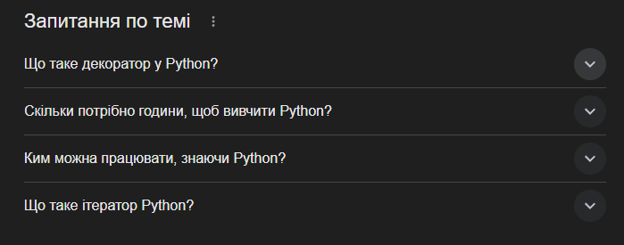

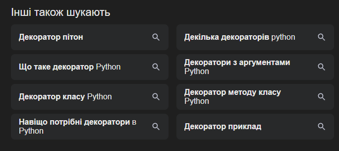

навіщо використовувати docker

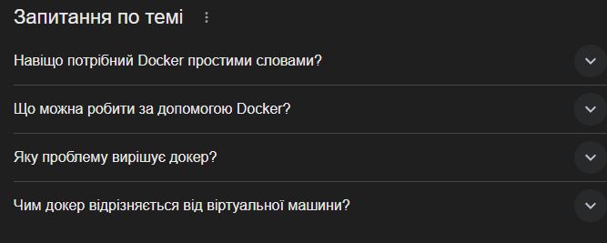

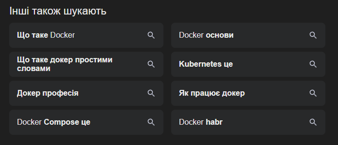

порівняння python vs ruby 2026

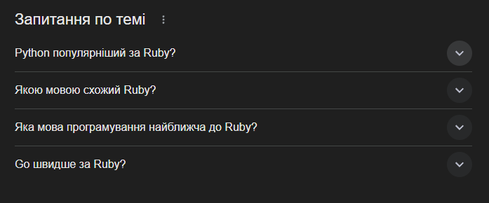

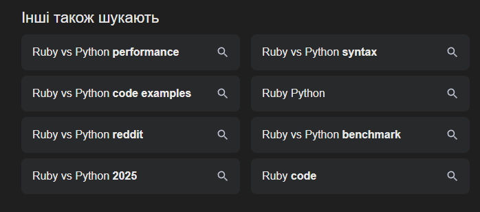

## Завдання 2.2
Для збору семантичного ядра через Google Keyword Planner було використано базові запити за тематикою IT-блогу. Пошук виконувався окремо для англійської та української мов, регіон — Україна. Для англомовної вибірки використовувались запити на кшталт web development, frontend development, backend development, javascript, devops, cybersecurity. Для україномовної вибірки використовувались запити веб розробка, frontend розробка, javascript, devops, кібербезпека, штучний інтелект. Отримані результати були використані для заповнення таблиці семантичного ядра: для ключових слів зафіксовано середньомісячну частотність, рівень конкуренції та додаткові нотатки щодо пріоритету й сезонності.

Серед результатів англомовної вибірки найбільшу частотність в Україні показали запити javascript (50000), web development (5000), devops (5000) та cybersecurity (5000). Для україномовної вибірки високий інтерес спостерігався за запитами javascript (50000), штучний інтелект (50000), devops (5000) та кібербезпека (5000). Це підтверджує доцільність обраної структури IT-блогу з окремими тематичними силосами під Python, Go, Ruby, DevOps, Cybersecurity та кар'єрний контент.

Рис. 1. Результати Google Keyword Planner для англійської мови, регіон Україна.

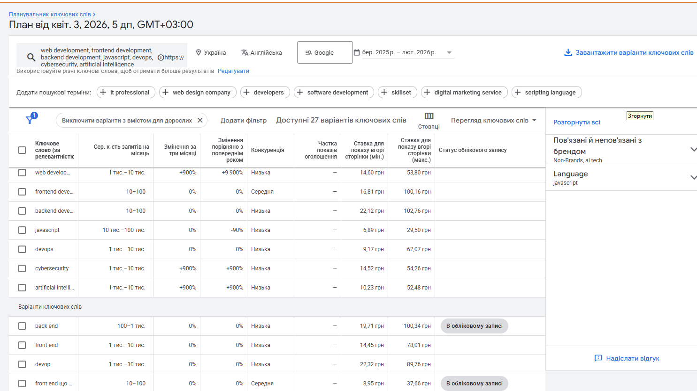

Рис. 2. Результати Google Keyword Planner для української мови, регіон Україна.

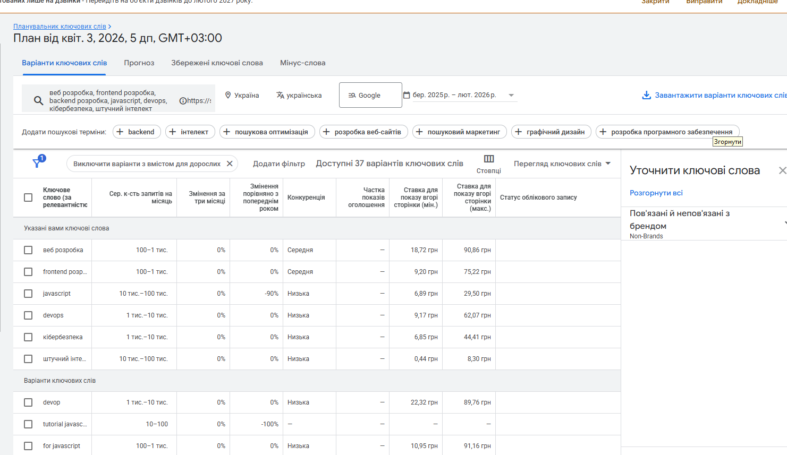

## Завдання 2.3
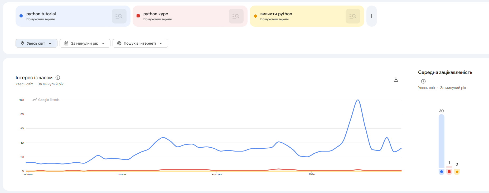

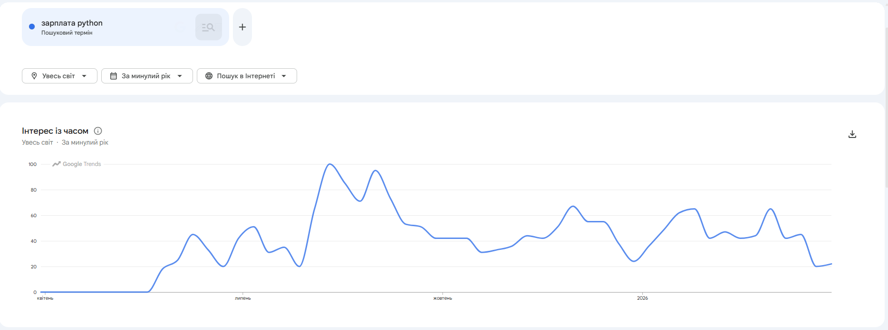

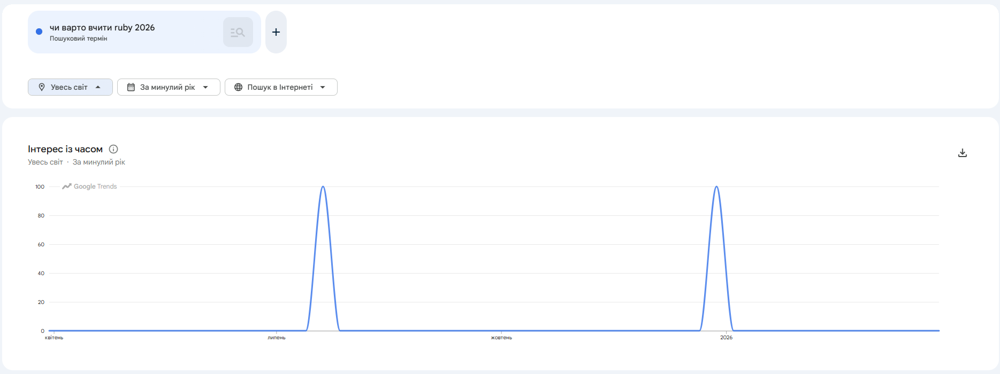

## Завдання 4.3
1. Чи кожна категорія є окремим тематичним силосом?

Так. Ми спроєктували структуру за принципом Silo Architecture. Кожен основний напрямок (Python, Go, Ruby, DevOps, Cybersecurity, Career in IT) має свою окрему сторінку категорії, яка об'єднує тематично пов'язані матеріали всередині одного силосу. Це допомагає пошуковим системам чітко визначати релевантність кожного розділу та підсилює тематичний авторитет сайту в окремих нішах.

2. Чи є перехресні посилання між різними силосами?

Так, вони є, і вони повністю виправдані. Ми використовуємо перехресні посилання лише там, де технології перетинаються логічно.

- Стаття про FastAPI (Python) посилається на Docker (DevOps) для пояснення процесу деплою.

- Порівняння Python vs Go пов'язує два різні силоси, що допомагає користувачеві в навігації та покращує поведінкові фактори. Такі посилання допомагають Google зрозуміти контекстні зв'язки між різними ІТ-сферами.

3. Яка максимальна глибина кліків від головної до будь-якої статті?

Максимальна глибина — 3 кліки.

Наша структура побудована за схемою:

Головна сторінка → Категорія (напр. /categories/python) → Стаття (напр. /blog/python-decorators).

Навіть для найвіддаленіших статей ми дотримуємося правила "трьох кліків", що гарантує швидку індексацію та зручність для користувачів.

4. Чи є orphan pages (сторінки-сироти)?

Ні, orphan pages немає. Кожна стаття отримує щонайменше одне посилання зі сторінки своєї категорії та додаткові вхідні посилання з тематично пов'язаних матеріалів усередині силосу. Допоміжні сторінки (/about, /contacts, /careers, /archive, /authors, /search) також включені в загальну структуру сайту, тому ізольованих сторінок у моделі не залишилось.

## Контрольні питання

### Рівень 1 - Розуміння термінів
1.  Що таке пошуковий інтент і чому Google надає йому пріоритет над точним входженням ключового слова?

> Пошуковий інтент — це справжня мета, з якою користувач вводить запит, і Google надає йому пріоритет, оскільки прагне вирішити проблему людини, а не просто знайти збіги букв у тексті. Сучасні алгоритми розуміють контекст, тому сторінка, яка дає вичерпну відповідь на запитання "як розгорнути сервер", ранжуватиметься вище за ту, де фраза просто повторюється багато разів без корисної суті.

2.  Яка різниця між head keywords, mid-tail та long-tail запитами? Наведіть приклади для IT тематики.

> Різниця між типами запитів полягає у їхній деталізації: head keywords — це короткі та дуже конкурентні слова, mid-tail — більш конкретні фрази, а long-tail — довгі, низькочастотні запити, що точно описують проблему. Хоча довгі запити мають менше пошуків, вони приводять найбільш цільову аудиторію з високою готовністю до дії.

3.  Що таке семантичне ядро і чим воно відрізняється від простого списку ключових слів?

> Семантичне ядро — це не просто перелік фраз, а фундаментальна мапа всіх можливих запитів, за якими користувачі можуть знайти проект, структурована за інтентом та категоріями. Від простого списку воно відрізняється наявністю ієрархії, показників частотності та чітким розподілом кожного слова під конкретну цільову сторінку.

4.  Поясніть концепцію silo-структури. Чому Google краще ранжує сайти з чіткою тематичною структурою?

> Концепція silo-структури полягає в ізоляції тематичних розділів сайту так, щоб вони не змішувалися між собою, утворюючи "вертикальні колодязі" знань. Google краще ранжує такі сайти, бо чітка структура допомагає алгоритмам швидше визначити експертність ресурсу в конкретній ніші та ефективно передавати "вагу" від головних сторінок до вкладених статей.

5.  Що таке канібалізація ключових слів і як вона шкодить SEO?

> Канібалізація ключових слів виникає тоді, коли кілька сторінок одного сайту оптимізовані під один і той самий запит, що змушує їх конкурувати між собою в пошуковій видачі. Це шкодить SEO, оскільки розпорошує авторитет сторінок, плутає пошукового робота при виборі релевантного результату і в підсумку знижує позиції обох сторінок замість виведення однієї в топ.

### Рівень 2 - Аналіз
1.  У вашому семантичному ядрі є запити з високою частотністю (High volume) та високою конкурентністю (High competition). Чи варто молодому сайту одразу на них орієнтуватись? Обґрунтуйте стратегію.

> Молодому сайту не варто одразу орієнтуватись на запити з високою частотністю та конкурентністю, оскільки у нього ще немає достатнього «авторитету» для боротьби з гігантами індустрії. Стратегія має базуватися на просуванні через Long-tail запити, які дозволяють швидше вийти в топ, зібрати перший цільовий трафік та поступово нарощувати вагу для майбутнього штурму висококонкурентних ключів.

2.  Два запити: "як встановити node.js" та "node.js download". Це один кластер чи різні? Поясніть через призму пошукового інтенту.

> Запити «як встановити node.js» та «node.js download» — це різні кластери, хоча вони стосуються одного продукту. Перший має Informational інтент (користувачеві потрібна інструкція, покроковий гайд), а другий — Transactional або Navigational (користувач хоче конкретну дію: отримати файл або перейти на офіційну сторінку завантаження). Google покаже різні типи результатів: для першого — статтю в блозі, для другого — офіційний сайт nodejs.org.

3.  Подивитись на топ-10 результатів Google для головного запиту свого блогу. Які типи сторінок там представлені? Що це говорить про інтент?

> Аналіз топ-10 для головного запиту нашого блогу (наприклад, «новини ІТ» або «програмування для початківців») зазвичай показує великі медіа-портали, агрегатори та освітні платформи. Це свідчить про те, що інтент є переважно Informational та Commercial Investigation. Користувач не шукає конкретну компанію, а хоче вивчити ринок, порівняти ресурси або отримати загальний огляд теми, що вимагає від нас створення об'ємних хаб-сторінок.

4.  Чому silo-структура передбачає мінімальну кількість посилань між різними силосами? Як це впливає на передачу PageRank?

> Silo-структура передбачає мінімальну кількість посилань між різними силосами, щоб максимально сконцентрувати тематичну релевантність всередині одного розділу. Це впливає на передачу PageRank таким чином, що «вага» посилань циркулює всередині силосу, підсилюючи кожну статтю як частину єдиної експертної бази. Якщо ми почнемо безконтрольно лінкувати всі сторінки між собою, PageRank «розмиється», і Google буде важче визначити, у чому саме наш сайт є справжнім експертом.

5.  Як Google Trends може допомогти у плануванні контент-календаря блогу? Наведіть конкретний приклад для IT тематики.

> Google Trends допомагає планувати контент-календар, виявляючи сезонні сплески інтересу до певних тем. Наприклад, в ІТ-тематиці запит «курси програмування» або «як стати тестувальником» традиційно має піки в січні (плани на новий рік) та вересні (початок навчального сезону). Знаючи це, ми можемо опублікувати відповідні гайди за місяць до піка, щоб вони встигли проіндексуватися та зайняти високі позиції саме тоді, коли попит буде максимальним.

### Рівень 3 - Синтез та висновки
1.  Порівняйте структуру свого сайту зі структурою відомого IT блогу (наприклад dev.toб, dou.ua, css-tricks.com, smashingmagazine.com). Які відмінності ви бачите і що б запозичили?

> Порівнюючи наш проект із DOU.ua, ми бачимо принципову різницю в підході до організації контенту. DOU використовує гібридну структуру: силосний підхід для великих розділів (Форум, Робота, Стрічка) та тегову систему для швидкої навігації. Наш сайт наразі має сувору ієрархічну структуру (Silo), тоді як DOU покладається на величезну кількість внутрішніх перехресних посилань та динамічні фільтри. Я б запозичила систему "Тематичних хабів" — коли навколо однієї широкої теми (наприклад, "Зарплати") збираються не лише статті, а й статистика, відгуки та обговорення, що створює максимальну глибину перегляду сторінок.

2.  Уявіть що ваш блог має 50 статей без семантичного ядра - просто те що здалось цікавим. Які SEO проблеми це може спричинити? Як це виправити?

> Наявність п'ятдесяти статей, написаних без семантичного ядра, створює серйозну проблему низької релевантності, коли контент може бути цікавим, але його ніхто не шукає через відсутність цільових запитів. Це призводить до канібалізації ключових слів, де декілька статей конкурують за одну й ту саму увагу пошукового робота, розпорошуючи загальну вагу сайту. Щоб виправити це, необхідно провести повний аудит контенту, згрупувати статті у логічні кластери, додати відсутні ключові слова в заголовки та налаштувати чітку внутрішню перелінковку для створення тематичної ієрархії.

3.  Як зміниться семантичне ядро якщо блог вирішить охопити не тільки україномовну, але й англомовну аудиторію? Що технічно треба змінити на сайті?

> При виході на англомовний ринок семантичне ядро доведеться будувати фактично з нуля, оскільки прямий переклад запитів не враховує іншу конкуренцію та інтент закордонної аудиторії. Технічно на сайті необхідно впровадити атрибути hreflang для кожної сторінки, щоб Google розумів взаємозв'язок між мовними версіями, а також змінити структуру URL-адрес на формат із підпапками або субдоменами. Це вимагатиме повної локалізації не лише текстів, а й мета-тегів, альтернативних описів зображень та мікророзмітки для кожної мовної версії окремо.

4.  Побудуте аргументацію, чому для новинного блогу silo-структура за категоріями краща ніж структура за датами публікацій?

> Аргументуючи вибір silo-структури для новинного блогу замість хронологічної, варто зазначити, що тематичне групування дозволяє новинам набагато довше зберігати свою вагу та актуальність. У структурі за датами цінні матеріали швидко зникають в архіві, тоді як силосний підхід концентрує PageRank усередині категорій, роблячи кожну новину частиною великого експертного розділу. Це дозволяє пошуковим системам краще ідентифікувати спеціалізацію сайту, а користувачам — легко знаходити пов'язані матеріали, що значно підвищує загальний авторитет ресурсу в конкретній ніші.
