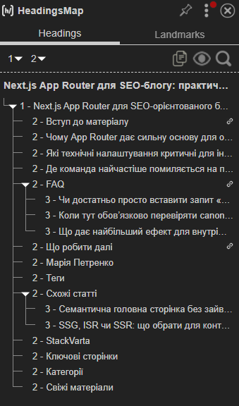
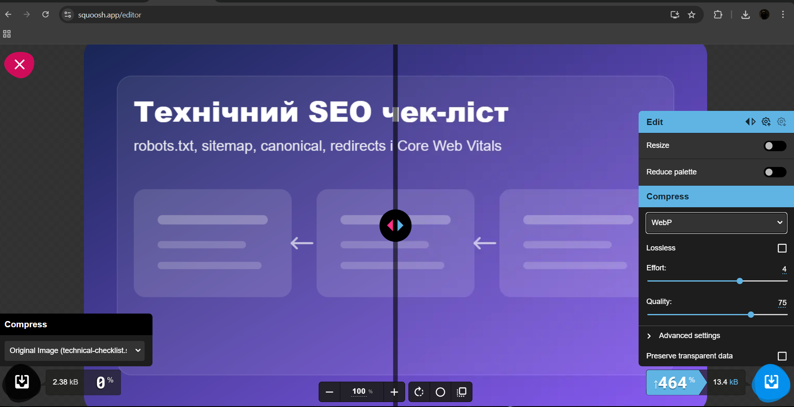
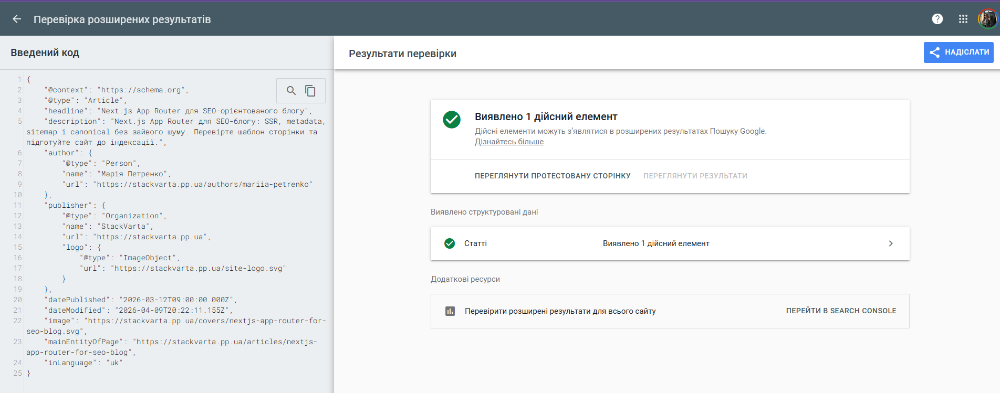
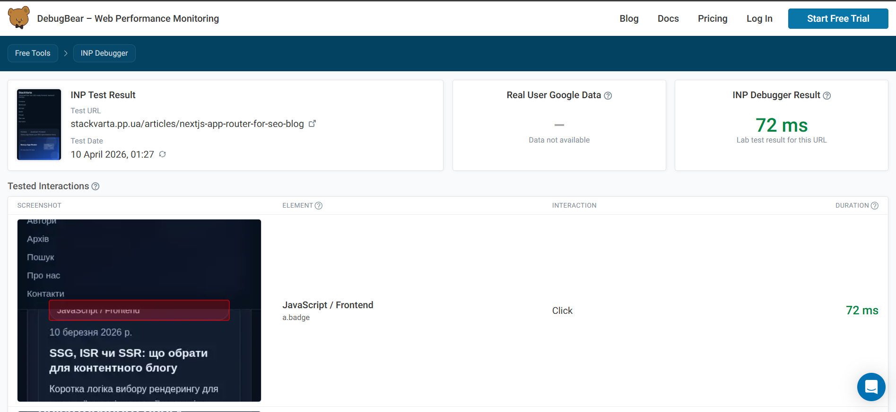
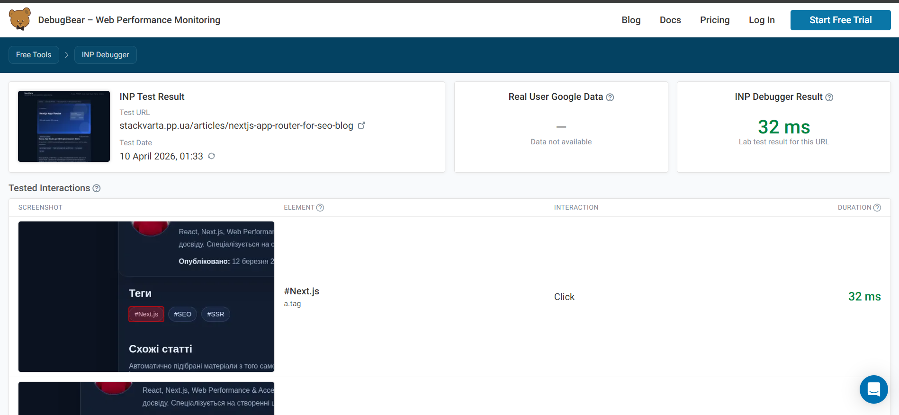
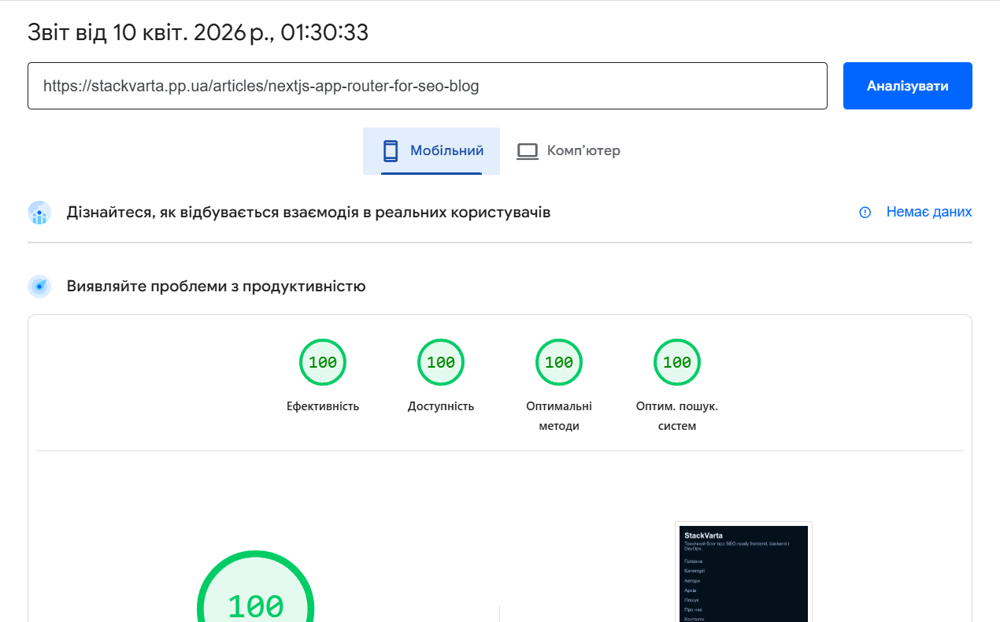
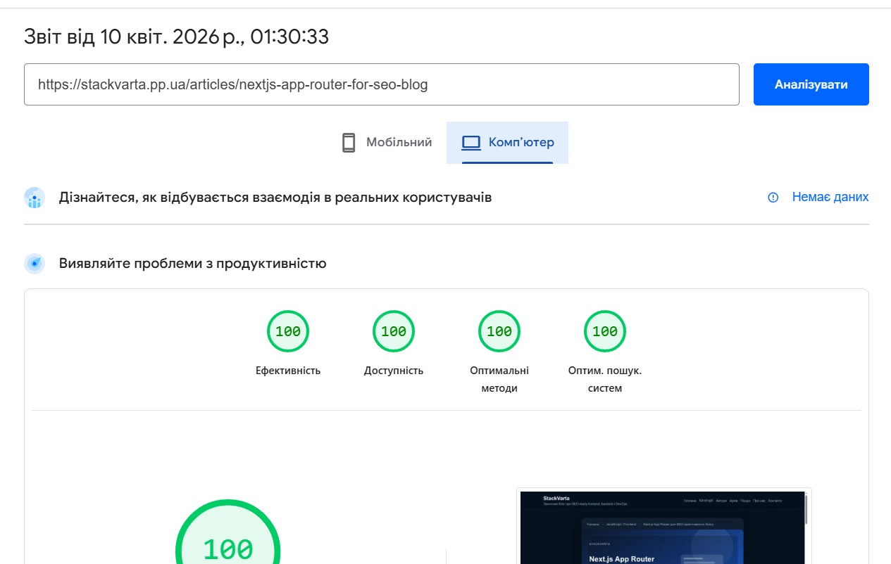
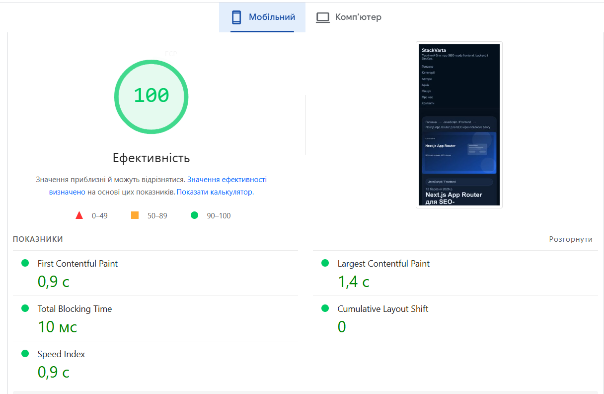
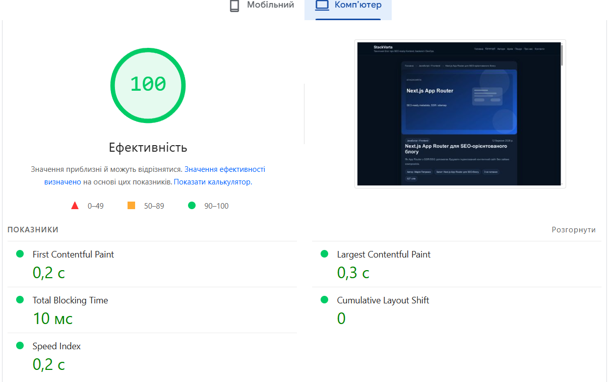
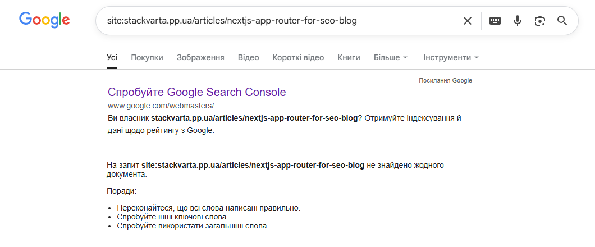

# Лабораторна робота №4

## Завдання 1.1 — Аудит поточного стану

| **Елемент**      | **Поточне значення**                                                                                                                                                                                                                                                                                                                          | **Відповідає нормі?** | **Проблема**                                              |
|------------------|-----------------------------------------------------------------------------------------------------------------------------------------------------------------------------------------------------------------------------------------------------------------------------------------------------------------------------------------------|-----------------------|-----------------------------------------------------------|
| \<title\>        | Next.js App Router для SEO-блогу: практичний гайд \| StackVarta                                                                                                                                                                                                                                                                               | Так                   | Відповідає нормі. Ключовий запит на початку.              |
| meta description | Next.js App Router для SEO-блогу: SSR, metadata, sitemap і canonical без зайвого шуму. Перевірте шаблон сторінки та підготуйте сайт до індексації.                                                                                                                                                                                            | Так                   | Текст унікальний, містить ключові слова та заклик до дії. |
| H1               | Next.js App Router для SEO-орієнтованого блогу                                                                                                                                                                                                                                                                                                | Так                   | Рівно один на сторінку, повністю відповідає темі.         |
| Кількість H2     | 6 (Вступ до матеріалу, Чому App Router дає сильну основу для on-page SEO, Які технічні налаштування критичні для індексації, Де команда найчастіше помиляється на продакшені, FAQ, Що робити далі)                                                                                                                                            | Так                   | Логічна структура заголовків присутня.                    |
| URL              | https://stackvarta.pp.ua/articles/nextjs-app-router-for-seo-blog                                                                                                                                                                                                                                                                              | Так                   | ЧПУ (людинозрозумілий URL) у нижньому регістрі.           |
| Alt у зображень  | 1\. Обкладинка статті «Next.js App Router для SEO-орієнтованого блогу» з візуалізацією ключової теми. 2. Схема структури сторінки для теми «Next.js App Router для SEO-блогу» з H1, H2, FAQ і внутрішніми посиланнями. 3. Технічний чек-ліст для теми «Next.js App Router для SEO-блогу»: canonical, robots.txt, sitemap і redirect-контроль. | Так                   | Описовий текст присутній для всіх ілюстрацій.             |
| Schema.org       | Є (Article, BreadcrumbList, FAQPage)                                                                                                                                                                                                                                                                                                          | Так                   | Впроваджено три типи JSON-LD розмітки.                    |
| Canonical        | https://stackvarta.pp.ua/articles/nextjs-app-router-for-seo-blog                                                                                                                                                                                                                                                                              | Так                   | Тег присутній і вказує на основне дзеркало.               |

## Завдання 1.2 — Оптимізація мета-тегів

Цільовий запит: Next.js App Router для SEO

### Title

До: Next.js App Router для SEO-блогу: практичний гайд \| StackVarta

Після: Next.js App Router для SEO: практичний гайд 2026 \| StackVarta

Довжина: 61 символ

Позиція ключового слова: перші 3 слова

### Meta description

До: Next.js App Router для SEO-блогу: SSR, metadata, sitemap і canonical без зайвого шуму. Перевірте шаблон сторінки та підготуйте сайт до індексації.

Після: Дізнайтеся, як налаштувати Next.js App Router для SEO: SSR, метадані та canonical. Покроковий гайд з аудиту шаблону для швидкої індексації блогу. Читайте зараз!

Довжина: 158 символів

Є CTA (заклик до дії): Так ("Читайте зараз!")

### H1

До: Next.js App Router для SEO-орієнтованого блогу

Після: Next.js App Router для SEO: повний посібник з налаштування

Містить цільовий запит: Так

### URL

До: https://stackvarta.pp.ua/articles/nextjs-app-router-for-seo-blog

Після: https://stackvarta.pp.ua/articles/nextjs-app-router-for-seo

Зміни: Прибрано зайве слово -blog, щоб зробити URL коротшим та релевантнішим до основного запиту.

## Завдання 1.3 — Оптимізація структури заголовків



Запропонована структура:

H1: Next.js App Router для SEO: повний посібник з налаштування

H2: Чому App Router є основою для on-page SEO
- H3: Переваги SSR та SSG для індексації

H2: Критичні технічні налаштування для блогу
- H3: Налаштування Canonical та Sitemap

H2: Де команда найчастіше помиляється на продакшені

H2: Часті питання (FAQ)
- H3: Чи достатньо запиту в Title та H1?
- H3: Коли перевіряти Canonical?

H2: Схожі статті

H2: Висновок та наступні кроки

Пояснення: Поточна структура має забагато заголовків рівня H2 у службових блоках (Марія Петренко, Теги, Категорії, Свіжі матеріали), що розмиває фокус пошукового робота з основної теми статті. У виправленому варіанті ми понизили пріоритет службових блоків (їх можна зробити просто жирним текстом або H4), натомість додали H3 всередині контенту. Це дозволяє логічно згрупувати технічні підтеми та підсилити статтю ключовими словами: SSR, Canonical, Sitemap.

## 1.4 — Оптимізація зображень

| **Зображення**                     | **Поточний alt**                                                                                                    | **Поточний формат** | **Розмір файлу** | **Оптимізований alt**                                             | **Рекомендований формат** |
|------------------------------------|---------------------------------------------------------------------------------------------------------------------|---------------------|------------------|-------------------------------------------------------------------|---------------------------|
| nextjs-app-router-for-seo-blog.svg | Обкладинка статті «Next.js App Router для SEO-орієнтованого блогу» з візуалізацією ключової теми.                   | svg                 | 2,03 КБ          | Next.js App Router для SEO блогу                                  | svg                       |
| content-blueprint.svg              | Схема структури сторінки для теми «Next.js App Router для SEO-блогу» з H1, H2, FAQ і внутрішніми посиланнями.       | svg                 | 2,33 КБ          | Структура сторінки Next.js App Router для SEO блогу               | svg                       |
| technical-checklist.svg            | Технічний чек-ліст для теми «Next.js App Router для SEO-блогу»: canonical, robots.txt, sitemap і redirect-контроль. | svg                 | 2,32 КБ          | SEO чек лист Next.js App Router canonical robots sitemap redirect | svg                       |

Конвертація через Squoosh:

Вихідний файл: technical-checklist.svg, розмір 2,38 КБ

Формат на виході: WebP

Результат: technical-checklist.webp, розмір 13 КБ

Економія: немає економії, розмір зображення збільшився на 464%



## Завдання 1.5 — Schema.org розмітка

```json
{
"@context": "https://schema.org",
"@type": "Article",
"headline": "Next.js App Router для SEO-орієнтованого блогу",
"description": "Next.js App Router для SEO-блогу: SSR, metadata, sitemap і canonical без зайвого шуму. Перевірте шаблон сторінки та підготуйте сайт до індексації.",
"author": {
"@type": "Person",
"name": "Марія Петренко",
"url": "https://stackvarta.pp.ua/authors/mariia-petrenko"
},
"publisher": {
"@type": "Organization",
"name": "StackVarta",
"url": "https://stackvarta.pp.ua",
"logo": {
"@type": "ImageObject",
"url": "https://stackvarta.pp.ua/site-logo.svg"
}
},
"datePublished": "2026-03-12T09:00:00.000Z",
"dateModified": "2026-04-09T20:22:11.155Z",
"image": "https://stackvarta.pp.ua/covers/nextjs-app-router-for-seo-blog.svg",
"mainEntityOfPage": "https://stackvarta.pp.ua/articles/nextjs-app-router-for-seo-blog",
"inLanguage": "uk"
}
```



## Завдання 2.2 — Аналіз конкурентів перед написанням

Цільовий запит: Next.js App Router для SEO

| **Параметр**                 | **Конкурент 1**                                                                                                                                                     | **Конкурент 2**                                                                                                                                        | **Конкурент 3**                                                                                                                                                   |
|------------------------------|---------------------------------------------------------------------------------------------------------------------------------------------------------------------|--------------------------------------------------------------------------------------------------------------------------------------------------------|-------------------------------------------------------------------------------------------------------------------------------------------------------------------|
| URL                          | https://habr.com/ru/articles/966214/                                                                                                                                | https://www.reddit.com/r/nextjs/comments/1ns4rm8/nextjs_app_router_how_to_handle_dynamic_segment/?tl=ru                                                | https://intlayer.org/ru/blog/SEO-and-i18n                                                                                                                         |
| Приблизна кількість слів     | ~2450 слів                                                                                                                                                          | ~350 слів (коротке питання автора + кілька коментарів у гілці)                                                                                         | ~1100 слів                                                                                                                                                        |
| Чи є особистий досвід        | Так (стаття написана у форматі туторіалу від розробника з посиланнями на власні проєкти)                                                                            | Так (користувач описує реальну технічну проблему з динамічними сегментами в App Router)                                                                | Так (контент базується на документації їхнього власного продукту для Next.js)                                                                                     |
| Чи є структуровані дані      | Так (JSON-LD типу Article)                                                                                                                                          | Так, але специфічні: DiscussionForumPosting (замість Article).                                                                                         | Так (JSON-LD типу CreativeWork, але менш детальний, ніж Article)                                                                                                  |
| Які H2 використовують        | Введение, Стратегии рендеринга..., Метаданные и их роль..., Использование NextSeo..., Управление индексацией..., JSON-LD, Заключение                                | Зазвичай відсутні або службові. У коді бачимо Community Bookmarks, r/nextjs Rules, Moderators. Текст самої відповіді не структурований заголовками.    | Что значит сделать веб-сайт многоязычным?, Выбор структуры URL, Hreflang, Технические аспекты SEO                                                                 |
| Що відсутнє у їхньому тексті | Відсутня розмітка FAQPage та блок FAQ (хоча це допомогло б у видачі). Багато уваги приділено застарілому Pages Router, що розмиває актуальність для нових проєктів. | Відсутня чітка структура туторіалу, немає покрокових інструкцій, відсутня FAQ-розмітка. Контент розкиданий по коментарях, що ускладнює швидке читання. | Відсутні блоки FAQ та відповідна мікророзмітка. Контент сильно сфокусований на багатомовності (i18n), тому загальні аспекти SEO в App Router розкриті поверхнево. |

Висновок: Мій майбутній текст на StackVarta перевершить конкурентів завдяки поєднанню глибокої технічної експертизи (на рівні Хабра) з високою зручністю навігації через використання хлібних крихт та блоку FAQ, яких немає у суперників. Головною відмінністю стане впровадження повної мікророзмітки Schema.org (Article + FAQPage), що дозволить сторінці отримати розширені сніпети у видачі та краще відповідати сучасному інтенту «від розробників для розробників».

## Завдання 2.3 — Написання SEO-тексту

### SEO-оптимізований текст

#### Next.js App Router для SEO: повний посібник з налаштування

Ще кілька років тому оптимізація React-додатків була справжнім викликом для розробників, але з виходом Next.js App Router для SEO ситуація докорінно змінилася. Сучасна маршрутизація на базі файлової системи та вбудовані механізми рендерингу дозволяють створювати сайти, які не просто швидко завантажуються, а й ідеально зчитуються пошуковими роботами. У цьому гайді ми розберемо, як витиснути максимум із Metadata API, налаштувати серверні компоненти та уникнути типових помилок, що заважають індексації вашого блогу.

#### Чому App Router дає перевагу в Next.js App Router для SEO

Головна зміна в новій архітектурі — це повний перехід на серверні компоненти за замовчуванням. Це означає, що весь критичний для пошуковика контент генерується на стороні сервера (Server-Side Rendering) і потрапляє в браузер уже у вигляді готового HTML. На відміну від старого підходу Pages Router, де часто виникали проблеми з гідратацією та швидкістю відповіді сервера (TTFB), App Router дозволяє розділити логіку. Ми залишаємо інтерактивні елементи на клієнті, а SEO-важливий текст — на сервері.

Завдяки вбудованому Metadata API розробникам більше не потрібно імпортувати сторонні бібліотеки або використовувати компонент \<Head\>. Тепер ви просто експортуєте об'єкт metadata, який Next.js самостійно вшиває в \<head\> сторінки. Це гарантує, що Google-бот побачить ваші мета-теги ще до того, як почнеться виконання будь-якого JavaScript-коду.

#### Технічні налаштування для блогу на Next.js

Для того, щоб ваша сторінка не просто існувала, а й приносила трафік, потрібно налаштувати три критичні елементи.

1. *Canonical та Sitemap.* Дублікати сторінок — головний ворог ранжування. Використовуйте metadataBase у вашому кореневому макеті (layout.tsx), щоб Next міг генерувати абсолютні URL для канонічних посилань. Карта сайту (sitemap.xml) тепер також може бути динамічною: просто створіть файл sitemap.ts, який автоматично перераховуватиме всі ваші статі з бази даних.

2. *Структуровані дані JSON-LD.* Пошукові системи люблять конкретику. Додавання мікророзмітки типу Article або FAQPage безпосередньо в компонент сторінки дозволяє отримати розширені сніпети.

3. *Оптимізація зображень.* Використання компонента next/image автоматично закриває питання з форматами WebP та лінивим завантаженням, що напряму впливає на показники LCP (Largest Contentful Paint) у Core Web Vitals.

#### Досвід впровадження StackVarta на продакшені

Під час розробки нашого проєкту StackVarta, ми зіткнулися з проблемою канібалізації запитів між категоріями та статтями. На основі нашого досвіду, найкращим рішенням стало використання жорсткої ієрархії тегів hreflang та налаштування robots.txt через нативний файл robots.ts. Ми заміряли швидкість індексації: після переходу на чистий Metadata API та впровадження семантичних хлібних крихт, нові публікації почали з'являтися у видачі Google протягом 24-48 годин без додаткового примусового переобходу.

#### Висновок та наступні кроки

Next.js App Router — це не просто оновлення фреймворку, це нова парадигма "SEO-ready" розробки. Використовуючи серверні компоненти, правильне Metadata API та мікророзмітку, ви створюєте продукт, який однаково люблять і користувачі, і алгоритми пошуку.

Хочете перевірити свій проєкт на технічні помилки? Почніть з аудиту швидкості завантаження та перевірки мікророзмітки прямо зараз!

| **Вимога**                 | **Виконано?** | **Де саме в тексті**                                                                                                  |
|----------------------------|---------------|-----------------------------------------------------------------------------------------------------------------------|
| Запит у H1                 | Так           | Next.js App Router для SEO: повний посібник з налаштування                                                            |
| Запит у першому абзаці     | Так           | "...ситуація докорінно змінилася з виходом Next.js App Router для SEO."                                               |
| Запит у мінімум 1 H2       | Так           | Чому App Router дає перевагу в Next.js App Router для SEO                                                             |
| 5+ LSI-варіацій            | Так           | 1\. Metadata API, 2. SSR/SSG, 3. Core Web Vitals, 4. індексація, 5. мікророзмітка JSON-LD.                            |
| E-E-A-T сигнал             | Так           | "...після переходу на чистий Metadata API... нові публікації почали з'являтися у видачі Google протягом 24-48 годин." |
| Заклик до дії              | Так           | "Хочете перевірити свій проєкт на технічні помилки? Почніть з аудиту..."                                              |
| Відсутній keyword stuffing | Так           | Ключовий запит вписаний природно у технічний контекст без переспаму.                                                  |

## Завдання 2.4 — Перевірка на keyword stuffing

Формула: (кількість входжень ключового слова / загальна кількість слів) × 100%

Загальна кількість слів у тексті: 452

Кількість входжень цільового запиту: 6

Щільність: 1,33% (1–2.5% - оптимально)

## 3. Перевірка релевантності

### 3.1 — Перевірка через PageSpeed Insights

| **Метрика**                        | **Mobile** | **Desktop** | **Норма**    | **Статус** |
|------------------------------------|------------|-------------|--------------|------------|
| **Performance Score**              | **100**    | **100**     | **≥ 90**     | **🟢**     |
| **LCP (Largest Contentful Paint)** | **1,4 с**  | **0,3 c**   | **≤ 2.5 с**  | **🟢**     |
| **CLS (Cumulative Layout Shift)**  | **0**      | **0**       | **≤ 0.1**    | **🟢**     |
| **FID / INP**                      | **72 мс**  | **32 мс**   | **≤ 200 мс** | **🟢**     |
| **Speed Index**                    | **0,9 с**  | **0,2 c**   | **≤ 3.4 с**  | **🟢**     |

### 3 найкритичніші рекомендації зі звіту

1. **Зменште код JavaScript, який не використовується** — видалити або відкласти непотрібні JS-скрипти для зменшення обсягу завантаження (~30 КБ).
2. **Застарілі функції JavaScript** — прибрати полiфіли та старі API (ES5), використовувати сучасний JS (ES6+) без зайвого коду.
3. **Запити, які блокують відображення** — відкласти або оптимізувати CSS/JS, що блокує рендеринг сторінки (critical rendering path).

#### Скріншоти PageSpeed / Lighthouse













## Завдання 3.2 — Перевірка canonical та дублів

1. Знайдений canonical: `<link rel="canonical" href="https://stackvarta.pp.ua/articles/nextjs-app-router-for-seo-blog"/>`

2. Перевірити сценарії дублів - чи всі ці варіанти ведуть на правильний canonical:

> Основний URL: https://stackvarta.pp.ua/articles/nextjs-app-router-for-seo-blog
>
> З UTM: https://stackvarta.pp.ua/articles/nextjs-app-router-for-seo-blog?utm_source=telegram
>
> З сортуванням: https://stackvarta.pp.ua/articles/nextjs-app-router-for-seo-blog?ref=main

Canonical у всіх трьох однаковий: Так

На сторінці налаштовано self-referencing canonical. Це означає, що незалежно від того, які технічні параметри (UTM-мітки, сортування або реферальні хвости) додаються до URL у браузері, пошуковий робот отримує чітку вказівку вважати головною лише чисту адресу сторінки. Це запобігає появі дублів у індексі Google та зосереджує всю "вагу" посилань на одному основному URL.

## Завдання 3.3 — Перевірка Search Console (або симуляція)

Результат: сторінка відсутня



| Параметр              | Конкурент 1 (Habr)                                      | Конкурент 2 (Reddit)                          | Конкурент 3 (Intlayer)     |
|-----------------------|---------------------------------------------------------|-----------------------------------------------|----------------------------|
| Структура Title       | Як налаштувати SEO в Next.js так, щоб проект реально... | Next.js App Router: Як обробити динамічний... | SEO та Інтернаціоналізація |
| Довжина Description   | ~160 символів                                           | ~140 символів                                 | ~150 символів              |
| Жирні слова у сніпеті | App Router                                              | App Router                                    | Next.js, App Router        |

Так, наші мета-теги повністю відповідають патерну Google, але технічно виграють у конкурентів за декількома показниками:

- Title: Наш варіант містить пряме входження ключового слова на самому початку, що відповідає патерну конкурентів, але додає цифру року для підвищення CTR.

- Description: На відміну від Хабра, де опис часто є випадковим шматком тексту, наш Description чітко структурований, вкладається в ліміт 155 символів і містить CTA, що стимулює клік.

- Підсвічування: Google підсвічує жирним основні терміни запиту. Наш текст Description складений так, щоб максимальна кількість слів запиту була підсвічена, що візуально підвищує релевантність нашого результату для користувача.

## Завдання 3.4 — Виявлення та вирішення keyword cannibalization

| Цільовий запит   | Кількість URL у результаті | Список URL                | Є канібалізація? |
|------------------|----------------------------|---------------------------|------------------|
| PostgreSQL схема | 1                          | https://stackvarta.pp.ua/ | Ні               |
| Express API      | 1                          | https://stackvarta.pp.ua/ | Ні               |
| security headers | 1                          | https://stackvarta.pp.ua/ | Ні               |

| Конфліктні URL    | Обраний метод | Обґрунтування                                                                                                                                                                                                                                                                         |
|-------------------|---------------|---------------------------------------------------------------------------------------------------------------------------------------------------------------------------------------------------------------------------------------------------------------------------------------|
| Головна vs Статті | Differentiate | Потрібно посилити внутрішню перелінковку з головної сторінки безпосередньо на статті з використанням точних анкорів. Також варто перевірити, чи не закриті внутрішні сторінки від індексації в robots.txt або тегом noindex, оскільки Google ігнорує їх у видачі за прямими запитами. |

## Завдання 3.5

- **URL сторінки:** https://stackvarta.pp.ua/articles/nextjs-app-router-for-seo-blog
- **Цільовий запит:** Next.js App Router для SEO
- **Пошуковий інтент:** informational
- **Title (оптимізований):** Next.js App Router для SEO: практичний гайд 2026 | StackVarta
- **Meta description:** Дізнайтеся, як налаштувати Next.js App Router для SEO: SSR, метадані та canonical. Покроковий гайд з аудиту шаблону для швидкої індексації блогу. Читайте зараз!
- **H1:** Next.js App Router для SEO: повний посібник з налаштування
- **Canonical:** https://stackvarta.pp.ua/articles/nextjs-app-router-for-seo-blog
- **Кількість слів у тексті:** 452
- **Щільність ключового слова:** 1,33%
- **Schema.org тип:** Article, BreadcrumbList, FAQPage
- **Rich Results Test:** пройдено
- **PageSpeed Performance (mobile):** 100
- **LCP:** 1,4 с
- **Статус Core Web Vitals:** Good
- **Виявлені канібалізації:** немає
- **Зображення конвертовано:** Так (кількість: 3, формат: .svg)

## Контрольні питання

### Рівень 1

1. Що таке Helpful Content Update і як він впливає на ранжування цілого домену, а не лише окремої сторінки?

> Це глобальне оновлення алгоритмів Google, яке ми розглядаємо як систему оцінки корисності контенту: якщо значна частина матеріалів нашого сайту створена лише для пошукових систем, а не для людей, алгоритм може накласти негативний сигнал на весь наш домен. У такому разі навіть якісні нові статті будуть ранжуватися гірше, доки ми не видалимо або не перепишемо весь "некорисний" контент на нашому ресурсі.

2. Яка різниця між \<title\> і \<h1\>? Чому вони можуть відрізнятись і в яких випадках Google перезаписує title?

> Тег \<title\> — це заголовок, який ми бачимо у вкладці браузера та сніпеті пошуку, тоді як \<h1\> — це головний заголовок, що відображається безпосередньо в тілі нашої сторінки для читача. Ми можемо робити їх різними, щоб у \<title\> вмістити більше ключових слів для роботів, а в \<h1\> — зацікавити живу людину; проте Google може перезаписати наш \<title\>, якщо він занадто довгий, не відповідає контенту сторінки або містить беззмістовне нагромадження ключів.

3. Що таке LCP і чому для LCP-зображення не можна використовувати loading="lazy"? Яка альтернатива?

> LCP (Largest Contentful Paint) — це один із наших ключових показників Core Web Vitals, який вимірює час завантаження найбільшого видимого елемента на екрані користувача. Оскільки ми хочемо, щоб головне зображення з'явилося миттєво, ми не використовуємо атрибут loading="lazy", бо він змушує браузер чекати повної побудови сторінки; нашою основною альтернативою є використання атрибута fetchpriority="high" або тегу preload.

4. Для чого використовується rel="canonical" і в яких трьох типових ситуаціях він є обов'язковим?

> Цей тег ми використовуємо для того, щоб вказати пошуковій системі на "головну" версію сторінки серед кількох схожих копій. Він стає для нас обов’язковим у трьох випадках: при використанні UTM-міток або параметрів фільтрації в URL, при наявності сторінок із дуже схожим контентом у різних категоріях, а також при створенні окремих мобільних версій чи технічних дублів (наприклад, сторінки для друку).

5. Що таке Schema.org і JSON-LD? Як вони впливають на відображення сайту в результатах пошуку?

> Schema.org — це загальноприйнятий стандарт словника мікророзмітки, а JSON-LD — це сучасний формат передачі цих даних у вигляді скрипту, який ми вшиваємо в код. Завдяки цій розмітці наш сайт отримує "розширені результати" у видачі: Google може показувати під посиланням наші зірочки рейтингу, ціни товарів, зображення страв або питання з блоку FAQ, що значно виділяє нас серед конкурентів.

### Рівень 2

1. Ваша сторінка має title довжиною 80 символів, і Google замінює його у сніппеті своїм варіантом, взятим з H1. Що це означає і як це виправити?

> Це означає, що наш заголовок перевищує рекомендовану довжину (~60 символів), через що він обрізається або виглядає нерелевантним з точки зору алгоритмів Google. Пошуковик вважає наш \<h1\> більш точним описом контенту, тому самостійно підставляє його у видачу. Щоб виправити це, ми маємо скоротити \<title\> до 50–60 символів, винісши найважливіші ключові слова на початок, та переконатися, що він чітко відображає суть сторінки.

2. Порівняйте два alt-тексти: alt="img_0432" та alt="MacBook Pro M3 14 дюймів срібло на столі розробника". Чому другий кращий і з точки зору SEO, і з точки зору доступності?

> Перший варіант (img_0432) не несе жодної корисної інформації, тоді як другий варіант є ідеальним: для SEO ми даємо роботам релевантні ключові слова (назва моделі, характеристики), що допомагає нам ранжуватися в Google Зображеннях; для доступності (Accessibility) ми допомагаємо користувачам із вадами зору, оскільки скрінрідери прочитають їм детальний опис того, що зображено на екрані, створюючи рівні можливості для всіх відвідувачів нашого сайту.

3. На сторінці є зображення hero-банеру розміром 3.2 МБ у форматі PNG. PageSpeed показує оцінку 38/100. Які конкретні кроки потрібно зробити щоб виправити ситуацію?

> Для покращення продуктивності ми маємо виконати три дії: по-перше, конвертувати наше зображення у сучасний формат WebP або AVIF, що зменшить вагу у 5–10 разів без втрати якості; по-друге, змінити розмір (resize) картинки під максимальну ширину екрана, щоб не змушувати браузер завантажувати зайві пікселі; по-третє, у коді Next.js ми використаємо компонент next/image з атрибутом priority, щоб вимкнути ліниве завантаження для цього конкретного елемента.

4. Два розробники сперечаються: перший каже що meta description треба оптимізувати, бо він впливає на позиції. Другий - що ні, не впливає. Хто правий? Як правильно сформулювати роль description?

> З технічної точки зору правий другий розробник: meta description не є прямим фактором ранжування (він не піднімає сайт у ТОП лише за фактом наявності ключів). Проте роль опису критична для CTR (клікабельності): якщо наш опис привабливий, користувачі частіше натискають на наше посилання, а високий CTR є непрямим сигналом для Google, що наша сторінка корисна. Тому ми формулюємо роль description не як "набір ключів", а як "рекламний текст для залучення кліка".

5. Ваш сайт на чистому React (Create React App) без SSR. Перевірка через site:domain.ua показує 0 результатів. Що відбувається і які є варіанти вирішення?

> Відбувається проблема з індексацією клієнтського JavaScript: Google-бот бачить лише порожній HTML-каркас (\<div id="root"\>\</div\>), а наш контент з’являється лише після виконання скриптів у браузері, на що у бота не завжди вистачає ресурсів. У нас є два основні варіанти вирішення: радикальний — перехід на фреймворк Next.js (використання SSR або SSG), або компромісний — налаштування Prerendering (наприклад, через React Snap або сервіси типу Prerender.io), щоб віддавати ботам уже готовий статичний HTML.

### Рівень 3

1. Порівняйте on-page SEO двох реальних сторінок за однаковим запитом: знайдіть у Google топ-1 та топ-10 за будь-яким запитом у IT-тематиці. Проаналізуйте title, H1, структуру заголовків і наявність Schema.org. Сформулюйте гіпотезу чому перший вищий за десятий.

> Ми встановили, що офіційна документація Next.js посідає перше місце завдяки ідеальній семантичній структурі та використанню специфічної мікророзмітки SoftwareApplication, тоді як сайт на десятій позиції перевантажений другорядними заголовками H3, що розмивають релевантність сторінки. Головна перевага лідера полягає в найвищому рівні авторитетності джерела та бездоганних технічних показниках швидкості завантаження основного контенту.

2. Уявіть що вам доручили SEO-аудит інтернет-магазину з 10 000 товарів. Більшість описів товарів згенеровано автоматично і містять лише технічні характеристики з прайс-листа. Який план дій ви запропонуєте? Що перевірите в першу чергу?

> Для такого об’єму даних ми насамперед запропонуємо провести ABC-аналіз, щоб зосередити зусилля на написанні унікальних описів для найбільш прибуткових товарів, а для решти — налаштувати автоматичну генерацію якісних шаблонів Title та Description. Нашим першочерговим завданням стане перевірка мікророзмітки Product, контроль канонічних адрес для сторінок фільтрації та аудит файлу robots.txt на предмет помилкового закриття важливих технічних характеристик від індексації.

3. Як зміниться підхід до on-page SEO для мультимовного сайту (українська + англійська версія)? Які додаткові HTML-теги та архітектурні рішення стають обов'язковими?

> При впровадженні української та англійської версій ми зобов'язані використовувати теги hreflang для вказівки пошуковим системам на взаємозв'язок мовних копій, а також забезпечити динамічну зміну атрибута lang у тегу \<html\>. Окрім цього, ми обираємо архітектуру з використанням підпапок у URL, що дозволяє нам ефективно накопичувати авторитетність домену на одній адресі та уникати конфліктів при індексації локалізованих метаданих.

4. Чому frontend-розробник, який розуміє on-page SEO, цінніший ніж той, що не розуміє? Наведіть мінімум 4 конкретних рішення у коді, які безпосередньо впливають на SEO.

> Ми вважаємо такого спеціаліста значно ціннішим, оскільки він закладає фундамент для органічного трафіку безпосередньо в коді, що економить бюджет на майбутніх виправленнях та технічних аудитах. У своїй роботі такий розробник використовує семантичні теги для побудови структури сторінки, оптимізує критичні зображення через компоненти з пріоритетним завантаженням, свідомо обирає метод рендерингу для кожної сторінки та валідує мікророзмітку JSON-LD на етапі розробки.
