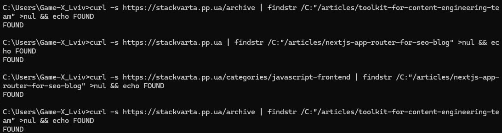
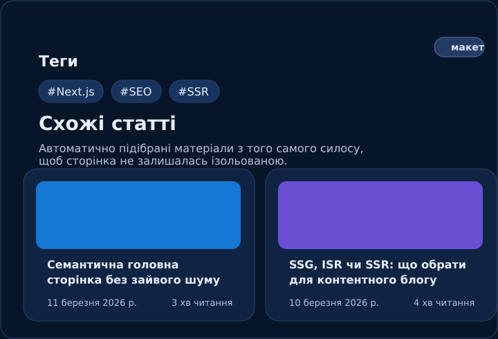
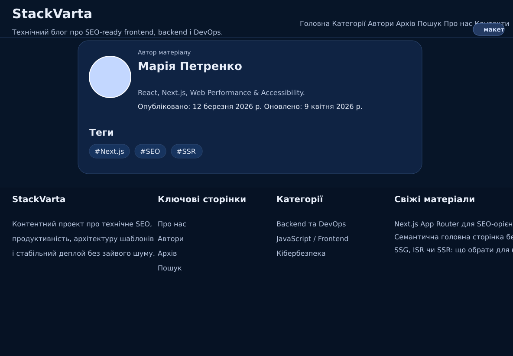
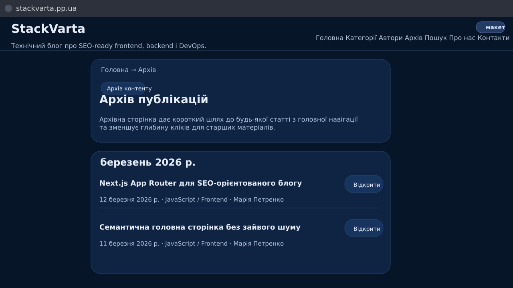

# Лабораторна робота №5. Внутрішня перелінковка

## Завдання 1.1

### Pages Inventory — основні сторінки

|URL|Тип сторінки|Назва|Вхідні посилання (к-сть)|Вихідні посилання (к-сть)|Статус|
|-|-|-|-|-|-|
|/|home|Головна|39|24|linked|
|/about|static|Про нас|39|15|linked|
|/authors|listing|Автори|39|20|linked|
|/archive|listing|Архів|39|27|linked|
|/contacts|static|Контакти|39|15|linked|
|/search|functional (noindex)|Пошук|39|15|linked|

### Pages Inventory — категорії

|URL|Тип сторінки|Назва|Вхідні посилання (к-сть)|Вихідні посилання (к-сть)|Статус|
|-|-|-|-|-|-|
|/categories/javascript-frontend|category|JavaScript / Frontend|39|20|linked|
|/categories/backend-devops|category|Backend та DevOps|39|23|linked|
|/categories/ai-ml|category|Штучний інтелект та ML|39|22|linked|
|/categories/cybersecurity|category|Кібербезпека|39|22|linked|
|/categories/tools-reviews|category|Огляди інструментів та технологій|39|22|linked|

### Pages Inventory — профілі авторів

|URL|Тип сторінки|Назва|Вхідні посилання (к-сть)|Вихідні посилання (к-сть)|Статус|
|-|-|-|-|-|-|
|/authors/mariia-petrenko|author|Марія Петренко|7|16|linked|
|/authors/andrii-koval|author|Андрій Коваль|7|17|linked|
|/authors/olena-dmytruk|author|Олена Дмитрук|6|18|linked|
|/authors/oleksii-vovk|author|Олексій Вовк|6|18|linked|
|/authors/serhii-bondarenko|author|Сергій Бондаренко|5|18|linked|

### Pages Inventory — статті

|URL|Тип сторінки|Назва|Вхідні посилання (к-сть)|Вихідні посилання (к-сть)|Статус|
|-|-|-|-|-|-|
|/articles/nextjs-app-router-for-seo-blog|article|Next.js App Router для SEO-орієнтованого блогу|39|19|linked|
|/articles/semantic-homepage-without-noise|article|Семантична головна сторінка без зайвого шуму|39|20|linked|
|/articles/ssg-isr-or-ssr-for-content-blog|article|SSG, ISR чи SSR: що обрати для контентного блогу|39|20|linked|
|/articles/express-api-foundation-for-it-blog|article|Express API основа для IT-блогу|39|21|linked|
|/articles/railway-guide-for-monorepo|article|Railway guide для монорепозиторію|39|21|linked|
|/articles/postgresql-schema-for-news-site|article|PostgreSQL схема для новинного сайту|10|20|linked|
|/articles/ai-tools-for-editorial-research|article|AI-інструменти для редакційного ресерчу|9|22|linked|
|/articles/ml-explainers-for-technical-blog|article|ML-пояснення для технічного блогу простими словами|8|21|linked|
|/articles/basic-security-headers-for-public-site|article|Базові security headers для публічного сайту|9|21|linked|
|/articles/why-admin-must-stay-out-of-index|article|Навіщо ховати admin від індексації|8|21|linked|
|/articles/google-search-console-without-chaos|article|Google Search Console без хаосу|10|21|linked|
|/articles/toolkit-for-content-engineering-team|article|Набір інструментів для контентної команди|7|22|linked|

### Pages Inventory — теги

|URL|Тип сторінки|Назва|Вхідні посилання (к-сть)|Вихідні посилання (к-сть)|Статус|
|-|-|-|-|-|-|
|/tags/nextjs|tag (noindex)|#Next.js|3|16|linked|
|/tags/ssr|tag (noindex)|#SSR|4|16|linked|
|/tags/react|tag (noindex)|#React|3|16|linked|
|/tags/nodejs|tag (noindex)|#Node.js|3|17|linked|
|/tags/postgresql|tag (noindex)|#PostgreSQL|3|17|linked|
|/tags/railway|tag (noindex)|#Railway|5|18|linked|
|/tags/devops|tag (noindex)|#DevOps|7|18|linked|
|/tags/seo|tag (noindex)|#SEO|11|19|linked|
|/tags/ai|tag (noindex)|#AI|3|18|linked|
|/tags/ml|tag (noindex)|#ML|3|18|linked|
|/tags/security|tag (noindex)|#Security|3|18|linked|
|/tags/tools|tag (noindex)|#Tools|10|22|linked|

## Завдання 1.2

**Висновок:** orphan pages у публічній частині сайту не виявлено. Усі HTML-сторінки отримують хоча б одне внутрішнє посилання з header/footer, категорій, архіву, профілів авторів, тегів або блоку `Схожі статті`.

```bash
curl -s https://stackvarta.pp.ua | findstr /C:"/articles/nextjs-app-router-for-seo-blog" >nul && echo FOUND
curl -s https://stackvarta.pp.ua/categories/javascript-frontend | findstr /C:"/articles/nextjs-app-router-for-seo-blog" >nul && echo FOUND
curl -s https://stackvarta.pp.ua/archive | findstr /C:"/articles/toolkit-for-content-engineering-team" >nul && echo FOUND
```

Усі три команди повернули `FOUND`. Orphan pages у публічній частині сайту не виявлено — кожна сторінка отримує щонайменше одне внутрішнє посилання в реальному HTML-відповіді сервера.



## Завдання 1.3

Для аудиту анкорів вибрано 5 статей із різних силосів.

|Сторінка-джерело|Анкор текст|URL призначення|Тип анкору|Оцінка|
|-|-|-|-|-|
|/articles/nextjs-app-router-for-seo-blog|JavaScript / Frontend|/categories/javascript-frontend|breadcrumb|✅|
|/articles/nextjs-app-router-for-seo-blog|Семантична головна сторінка без зайвого шуму|/articles/semantic-homepage-without-noise|descriptive|✅|
|/articles/nextjs-app-router-for-seo-blog|SSG, ISR чи SSR: що обрати для контентного блогу|/articles/ssg-isr-or-ssr-for-content-blog|descriptive|✅|
|/articles/express-api-foundation-for-it-blog|Backend та DevOps|/categories/backend-devops|breadcrumb|✅|
|/articles/express-api-foundation-for-it-blog|Railway guide для монорепозиторію|/articles/railway-guide-for-monorepo|descriptive|✅|
|/articles/express-api-foundation-for-it-blog|PostgreSQL схема для новинного сайту|/articles/postgresql-schema-for-news-site|descriptive|✅|
|/articles/ai-tools-for-editorial-research|Штучний інтелект та ML|/categories/ai-ml|breadcrumb|✅|
|/articles/ai-tools-for-editorial-research|ML-пояснення для технічного блогу простими словами|/articles/ml-explainers-for-technical-blog|descriptive|✅|
|/articles/ai-tools-for-editorial-research|Next.js App Router для SEO-орієнтованого блогу|/articles/nextjs-app-router-for-seo-blog|descriptive|✅|
|/articles/basic-security-headers-for-public-site|Кібербезпека|/categories/cybersecurity|breadcrumb|✅|
|/articles/basic-security-headers-for-public-site|Навіщо ховати admin від індексації|/articles/why-admin-must-stay-out-of-index|descriptive|✅|
|/articles/basic-security-headers-for-public-site|Next.js App Router для SEO-орієнтованого блогу|/articles/nextjs-app-router-for-seo-blog|descriptive|✅|
|/articles/google-search-console-without-chaos|Огляди інструментів та технологій|/categories/tools-reviews|breadcrumb|✅|
|/articles/google-search-console-without-chaos|Набір інструментів для контентної команди|/articles/toolkit-for-content-engineering-team|descriptive|✅|
|/articles/google-search-console-without-chaos|Railway guide для монорепозиторію|/articles/railway-guide-for-monorepo|descriptive|✅|

**Висновок:** у body, breadcrumbs та related-блоках домінують **descriptive** і **breadcrumb** анкори, що добре для SEO. Проблемні generic-анкори залишаються переважно у кнопках карток (`Читати статтю`, `Перейти до статті`, `Відкрити`) і винесені в чек-ліст як backlog.

## Завдання 1.4

У поточній структурі будь-яка стаття досяжна максимум за **2 кліки** від головної сторінки.

|Сторінка|Шлях від головної|Кількість кліків|Статус|
|-|-|-|-|
|/articles/nextjs-app-router-for-seo-blog|/ → /articles/nextjs-app-router-for-seo-blog|1|✅|
|/articles/semantic-homepage-without-noise|/ → /articles/semantic-homepage-without-noise|1|✅|
|/articles/ssg-isr-or-ssr-for-content-blog|/ → /articles/ssg-isr-or-ssr-for-content-blog|1|✅|
|/articles/express-api-foundation-for-it-blog|/ → /articles/express-api-foundation-for-it-blog|1|✅|
|/articles/railway-guide-for-monorepo|/ → /articles/railway-guide-for-monorepo|1|✅|
|/articles/postgresql-schema-for-news-site|/ → /articles/postgresql-schema-for-news-site|1|✅|
|/articles/ai-tools-for-editorial-research|/ → /articles/ai-tools-for-editorial-research|1|✅|
|/articles/ml-explainers-for-technical-blog|/ → /articles/ml-explainers-for-technical-blog|1|✅|
|/articles/basic-security-headers-for-public-site|/ → /articles/basic-security-headers-for-public-site|1|✅|
|/articles/why-admin-must-stay-out-of-index|/ → /articles/why-admin-must-stay-out-of-index|1|✅|
|/articles/google-search-console-without-chaos|/ → /archive → /articles/google-search-console-without-chaos|2|✅|
|/articles/toolkit-for-content-engineering-team|/ → /archive → /articles/toolkit-for-content-engineering-team|2|✅|

**Висновок:** порушень правила `<= 3 кліки` не виявлено.

## Завдання 1.5

|Помилка|Присутня|Де саме|Як виправити|
|-|-|-|-|
|Orphan pages|Ні|Не виявлено серед 40 публічних HTML-сторінок|Поточна структура вже закриває проблему: header/footer, категорії, архів, профілі авторів, теги, related articles.|
|Generic анкори ("тут", "click here")|Так, частково|Кнопки `Читати статтю`, `Перейти до статті`, `Відкрити` у картках і в архіві|Замінити CTA на більш описові формулювання на кшталт `Читати: [назва статті]` або залишити кнопки, але основний title-anchor зробити головним клікабельним елементом.|
|Посилання на себе|Так|Поточна сторінка залишається лінком на себе в header/footer (наприклад `/about`, `/archive`, `/authors`)|Для активного пункту меню/футера замінити `<a>` на неактивний елемент з `aria-current="page"`.|
|Зламані внутрішні посилання (404)|Ні (за кодовим аудитом)|Усі внутрішні href ведуть на наявні маршрути `/`, `/about`, `/archive`, `/authors/[slug]`, `/categories/[slug]`, `/articles/[slug]`, `/tags/[slug]`, `/search`, `/contacts`|Після деплою прогнати Screaming Frog або перевірити вручну 5–10 ключових сторінок.|
|Надлишкова перелінковка (10+ посилань на абзац)|Ні|У body статей посилання розподілені рівномірно між вступом, секціями, FAQ і related-block|Залишити поточний підхід.|
|Глибина кліків > 3|Ні|Усі статті доступні максимум за 2 кліки від головної|Залишити `/archive` і категорійні хаби в навігації.|
|Посилання через JS (onclick) замість `<a href>`|Ні|У публічній частині використано `next/link` або звичайний `<a>`|Залишити поточну реалізацію.|
|Nofollow на внутрішніх посиланнях|Ні|На внутрішніх лінках nofollow не використовується|Залишити поточну реалізацію.|

## Завдання 2.1

### Принципи схеми для StackVarta

**Горизонтальна перелінковка (всередині силосу):**

```text
Категорія → усі статті цієї категорії
Стаття → 1–3 схожі статті тієї самої категорії
Стаття → сторінка категорії через breadcrumb + badge
```

**Вертикальна перелінковка (між рівнями):**

```text
Головна → усі категорії
Головна → featured/latest статті
Архів → усі статті
Профіль автора → статті автора
```

**Перехресна перелінковка (між силосами) — тільки коли є сенсовий зв’язок:**

```text
AI-стаття → Next.js/SEO-стаття
Security-стаття → Next.js/SEO-стаття
Випадкове посилання без тематичного зв’язку
```

## Завдання 2.2

|Звідки (URL)|Куди (URL)|Анкор текст|Тип посилання|Розміщення на сторінці|Пріоритет|
|-|-|-|-|-|-|
|/|/categories/javascript-frontend|JavaScript / Frontend|nav|header navigation|high|
|/|/categories/backend-devops|Backend та DevOps|nav|header navigation|high|
|/|/categories/ai-ml|Штучний інтелект та ML|nav|header navigation|high|
|/|/categories/cybersecurity|Кібербезпека|nav|header navigation|high|
|/|/categories/tools-reviews|Огляди інструментів та технологій|nav|header navigation|high|
|/|/articles/nextjs-app-router-for-seo-blog|Next.js App Router для SEO-орієнтованого блогу|contextual|featured articles block|high|
|/|/articles/semantic-homepage-without-noise|Семантична головна сторінка без зайвого шуму|contextual|featured articles block|high|
|/|/articles/express-api-foundation-for-it-blog|Express API основа для IT-блогу|contextual|latest articles grid|medium|
|/|/archive|Архів|nav|header navigation|high|
|/categories/javascript-frontend|/articles/nextjs-app-router-for-seo-blog|Next.js App Router для SEO-орієнтованого блогу|contextual|article listing|high|
|/categories/javascript-frontend|/articles/semantic-homepage-without-noise|Семантична головна сторінка без зайвого шуму|contextual|article listing|medium|
|/categories/backend-devops|/articles/railway-guide-for-monorepo|Railway guide для монорепозиторію|contextual|article listing|high|
|/categories/backend-devops|/articles/postgresql-schema-for-news-site|PostgreSQL схема для новинного сайту|contextual|article listing|medium|
|/articles/nextjs-app-router-for-seo-blog|/categories/javascript-frontend|JavaScript / Frontend|breadcrumb|breadcrumb nav|high|
|/articles/nextjs-app-router-for-seo-blog|/articles/semantic-homepage-without-noise|Семантична головна сторінка без зайвого шуму|contextual|article body|medium|
|/articles/nextjs-app-router-for-seo-blog|/articles/ssg-isr-or-ssr-for-content-blog|SSG, ISR чи SSR: що обрати для контентного блогу|contextual|article body|medium|
|/articles/nextjs-app-router-for-seo-blog|/articles/railway-guide-for-monorepo|Railway guide для монорепозиторію|contextual|article body|medium|
|/articles/express-api-foundation-for-it-blog|/categories/backend-devops|Backend та DevOps|breadcrumb|breadcrumb nav|high|
|/articles/express-api-foundation-for-it-blog|/articles/railway-guide-for-monorepo|Railway guide для монорепозиторію|contextual|article body|medium|
|/articles/express-api-foundation-for-it-blog|/articles/postgresql-schema-for-news-site|PostgreSQL схема для новинного сайту|related|related articles block|medium|
|/articles/google-search-console-without-chaos|/categories/tools-reviews|Огляди інструментів та технологій|breadcrumb|breadcrumb nav|high|
|/articles/google-search-console-without-chaos|/articles/toolkit-for-content-engineering-team|Набір інструментів для контентної команди|related|related articles block|low|
|/authors/mariia-petrenko|/articles/nextjs-app-router-for-seo-blog|Next.js App Router для SEO-орієнтованого блогу|contextual|article listing|medium|
|/archive|/articles/toolkit-for-content-engineering-team|Набір інструментів для контентної команди|contextual|archive list|medium|
|/contacts|/about|Про нас|utility|quick links block|low|

## Завдання 2.3

Блок **`Схожі статті`** впроваджено на сторінці `/articles/[slug]`.

Логіка роботи:
- для поточної статті визначається її `categorySlug`;
- далі автоматично підбираються інші статті з тієї самої категорії;
- на сторінці виводиться до 3 матеріалів у вигляді карток;
- це прибирає ризик ізольованої статті всередині силосу і підсилює внутрішню перелінковку.

**Скріншот блоку `Схожі статті`:**



## Завдання 2.4

Breadcrumbs впроваджено на сторінках статей. Формат:

```text
Головна → [Категорія] → [Назва статті]
```

Приклад для статті:

```text
Головна → JavaScript / Frontend → Next.js App Router для SEO-орієнтованого блогу
```

**Скріншот breadcrumbs на сторінці статті:**


## Завдання 3

|№|Проблема|Тип|Що зроблено|URL де виправлено|
|-|-|-|-|-|
|1|Статті одного силосу були слабко зв’язані між собою на рівні шаблону сторінки статті|orphan / nav-only risk|На `/articles/[slug]` додано блок `Схожі статті`, який автоматично підтягує матеріали з тієї самої категорії через `getRelatedArticles(slug, 3)`.|/articles/[slug]|
|2|На шаблоні статті не було явного шляху `Головна → Категорія → Стаття`|глибина / інше|На `/articles/[slug]` додано breadcrumbs, які скорочують навігаційний шлях і дають ще один стабільний вхід на сторінку категорії.|/articles/[slug]|
|3|Старі матеріали мали менше точок входу з головної та могли втрачати discoverability|глибина|Додано сторінку `/archive` і посилання на неї в header/footer. Тепер усі статті доступні максимум за 2 кліки від головної.|/archive, /, /articles/[slug]|

### Виправлення 1 — блок `Схожі статті`

**До:**



**Після:**


### Виправлення 2 — breadcrumbs

**До:**


**Після:**


### Виправлення 3 — сторінка `/archive`

**До:**


**Після:**



## Контрольні питання

### Рівень 1 — Розуміння термінів

**1. Що таке PageRank і як внутрішня перелінковка впливає на передачу "ваги" між сторінками?**

> PageRank — це умовна «вага» сторінки, яка передається через посилання на інші сторінки. Внутрішня перелінковка дозволяє перекинути частину авторитету з сильних сторінок (головна, категорії, архів) на глибші URL, тому добре структуровані хаби й контекстні лінки напряму впливають на SEO.

**2. Що таке orphan page і чому сторінка може бути в sitemap але не бути знайденою Google?**

> Orphan page — це сторінка, на яку не веде жодне внутрішнє посилання. Навіть якщо URL є в sitemap, Google може повільно доходити до нього або вважати його другорядним, бо сторінка не вбудована в реальну навігацію сайту.

**3. Яка різниця між `rel="nofollow"` та `rel="noopener"` на посиланні? Коли використовувати кожен?**

> `nofollow` підказує пошуковику не передавати вагу через посилання. Для внутрішніх лінків його зазвичай не використовують. `noopener` — це безпековий атрибут для зовнішніх посилань з `target="_blank"`, щоб нова вкладка не отримувала доступ до `window.opener`.

**4. Чому посилання всередині тексту статті (contextual links) цінніші для SEO ніж посилання в навігації або footer?**

> Contextual links стоять поруч із тематичним текстом і мають сильніший семантичний сигнал. Для Google це підказка, що сторінка-одержувач дійсно пов’язана з темою абзацу, тоді як header/footer — це радше технічна навігація.

**5. Що таке "crawl depth" і яке максимальне значення вважається прийнятним?**

> Crawl depth — це кількість кліків від головної до цільової сторінки. Для контентного блогу прийнятним вважається значення до 3 кліків, а найкраще — 1–2 кліки для ключових матеріалів.

### Рівень 2 — Аналіз

**6. На сторінці категорії є 50 посилань на статті. Чи є це проблемою з точки зору передачі PageRank? Як це впливає на кожне окреме посилання?**

> Сам факт 50 посилань ще не є критичною помилкою, якщо сторінка логічно структурована і всі посилання корисні. Але що більше вихідних лінків, то менша частка умовної ваги дістається кожному окремому URL. Тому довгі списки краще розбивати пагінацією, архівом і тематичними підбірками.

**7. Розглянь два варіанти анкору для посилання на статтю про JavaScript замикання: (а) "читати тут" та (б) "як працюють замикання в JavaScript". Поясни детально чому другий кращий з точки зору Google.**

> Анкор `читати тут` не описує вміст цільової сторінки і майже не дає семантичного сигналу. Анкор `як працюють замикання в JavaScript` одразу пояснює тему матеріалу, містить ключові слова природною мовою і допомагає Google краще зрозуміти, що саме знаходиться за посиланням.

**8. Твій блог має 3 статті в категорії "JavaScript" і жодна не посилається одна на одну. Як це впливає на silo-структуру і передачу авторитету?**

> У такому випадку силос працює слабше: категорія формально об’єднує матеріали, але самі статті не підсилюють одна одну. Через це Google гірше бачить тематичний кластер, а читачам складніше перейти до суміжних матеріалів. Саме тому в StackVarta на сторінках статей додано body-links і блок `Схожі статті`.

**9. Що відбудеться з PageRank якщо сторінка посилається сама на себе? Чи є це проблемою?**

> Самопосилання не дає корисного SEO-ефекту, бо сторінка не відкриває новий маршрут і не підсилює жоден інший URL. Це не критична помилка, але це зайвий шум у навігації, тому активні пункти меню краще відображати як поточний стан, а не як клікабельний лінк на самого себе.

**10. Порівняй передачу "link juice" через header navigation та через contextual посилання в тілі статті. Що сильніше і чому?**

> Header navigation потрібна для стабільного обходу сайту і гарантує доступність ключових розділів. Але сильніший SEO-сигнал зазвичай дають contextual links у тілі статті, тому що вони прив’язані до конкретної теми, анкору і смислового оточення.

### Рівень 3 — Синтез та висновки

**11. Проаналізуй схему перелінковки свого сайту. Які сторінки отримують найбільше внутрішніх посилань? Чи відповідає це їхній важливості для SEO стратегії?**

> Найбільше внутрішніх посилань у StackVarta отримують головна сторінка, категорії, `about`, `archive`, `authors`, `contacts`, `search` та частина ключових статей, які стоять у global navigation, footer або на першій сторінці головної. Це відповідає стратегії: найсильніші сигнали йдуть на хаби та ключові вхідні URL, а не на випадкові сторінки.

**12. Уяви що головна сторінка твого блогу має PageRank 10 (умовно). Побудуй схему як цей "вага" розподіляється по сторінках після 2–3 переходів. Яка сторінка отримає найменше?**

> Після першого переходу основна частина умовної ваги йде на категорії, архів, профілі авторів та featured/latest статті. На другому переході вага розподіляється на сторінки статей, тегів і профілі конкретних авторів. Найменше зазвичай отримують noindex tag-pages і найстаріші статті, які не входять у top featured блоки, тому їх і варто підсилювати через архів, категорії та related-links.

**13. На відомому IT-ресурсі (наприклад dou.ua або ain.ua) проаналізуй схему внутрішньої перелінковки: breadcrumbs, related articles, теги, навігація. Що вони роблять що варто запозичити?**

> Для великих IT-медіа найсильнішими практиками є: стабільні рубрики/хаби в головній навігації, breadcrumbs на статтях, блоки суміжних матеріалів, лінки на автора, а також архіви/теги як допоміжні точки входу. Для власного проєкту варто запозичити саме цю багаторівневу модель: хаб → стаття → суміжні матеріали → автор / архів.

**14. Як зміниться схема перелінковки якщо блог додасть нову функцію — серії статей (course/series)? Спроектуй нову структуру посилань для цього випадку.**

> Якщо додати серії статей, потрібно створити окремий хаб `/series` і сторінки виду `/series/[slug]`. Далі кожна стаття серії має посилатися на хаб серії, попередній і наступний матеріал, а сторінка серії — на всі уроки в правильному порядку. Це дасть ще одну сильну вертикаль перелінковки поверх звичайних категорій.
